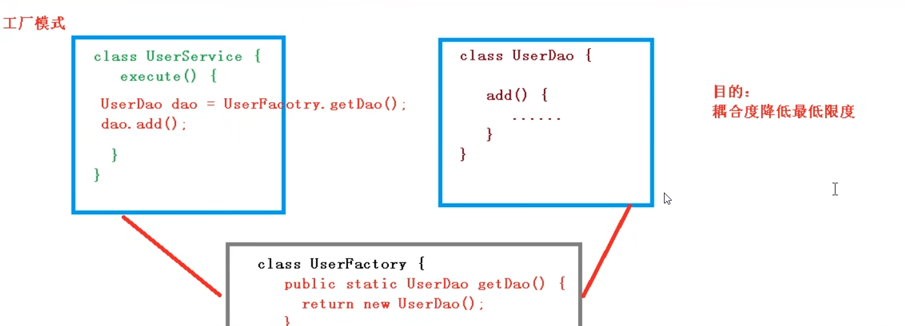

IOC(控制反转)
---
对象的创建和对象之类的调用，交给spring管理

耦合度降低

底层原理
---
xml解析，工厂模式，反射

IOC底层就是**对象工厂**，通过读取xml文件读取 包路径类全名

然后 通过 

    Class.forName(),newInstance();创建对象

实现IOC的两种方式（两个接口）
---

BeanFactory

ApplicationContext

两种方式都可以创建bean

BeanFactory是spring IOC内置的最基本的实现方式 给内部中用，不提供给开发人员进行使用

BeanFactory是**懒汉模式**， 在加载配置文件时，不会创建对象，只有在调用

    beanFactory.getBean()时才会创建对象

ApplicationContext是BeanFactory的子接口，提供更多的方法，一般由开发人员使用

ApplicationContext是**饿汉模式** 在加载配置文件时，就会把配置文件中的对象创建

（单例模式下 ，如果是bean的创建模式是多实例，在每次getBean才会创建一个对象）

相对来说 在Tomcat容器启动时完成bean加载，比在启动后，程序执行时再加载bean好些，类似用空间换时间

ApplicationContext的实现类
---

ApplicationContext中fileSystem和classPath分别是读取系统路径和项目路径