AOP 
---

面向切面编程

静态代理和动态代理
---

静态代理代理的角色是固定的 如果接口实现类有多个 每个都需要创建一个静态代理类

而动态代理是通过反射来实现 较为灵活 基于接口的JDK代理 和基于类子类的CJLib代理

类实现了接口 使用JDK生成代理类
---

JDK代理类非new出来的

创建的是接口实现类 作为代理类增强逻辑

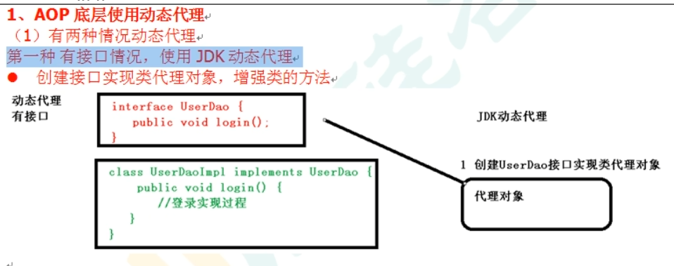

没有实现接口 使用CJLib实现代理类
---

创建的是类的子类 作为代理类增强逻辑

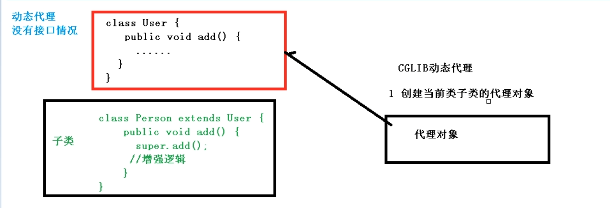

AOP 基于JDK的实现原理
---

使用jdk动态代理，使用proxy类里的方法创建代理对象

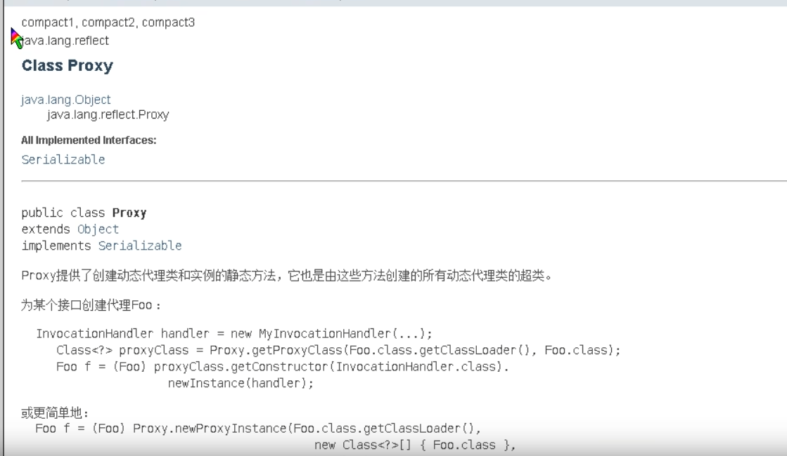

类加载器

增强方法所在类的接口，接口可以有多个

invocationHandler 实现这个接口 创建代理对象 写增强的方法

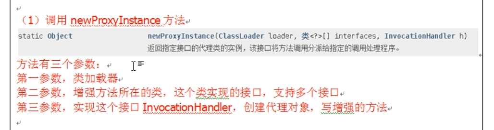

实现步骤
---

接口

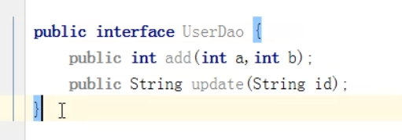

实现类

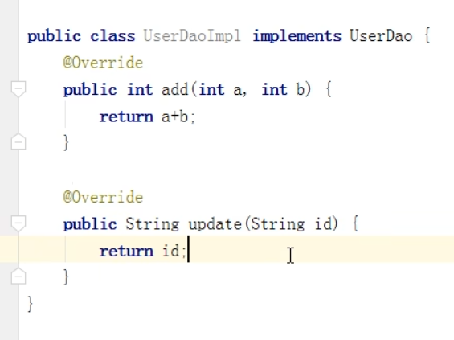

创建代理对象 实现 invocationHandler

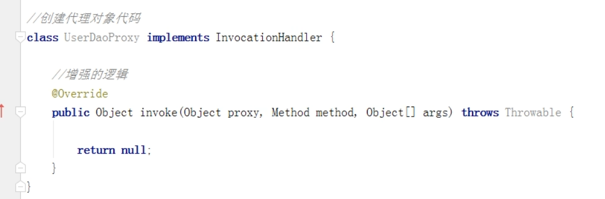

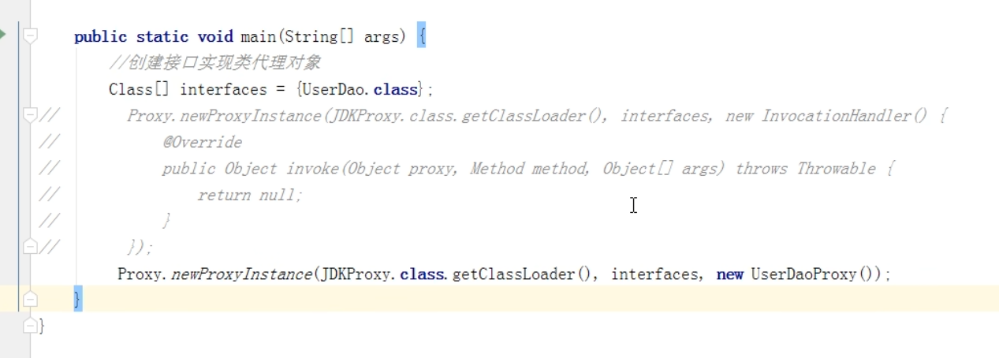

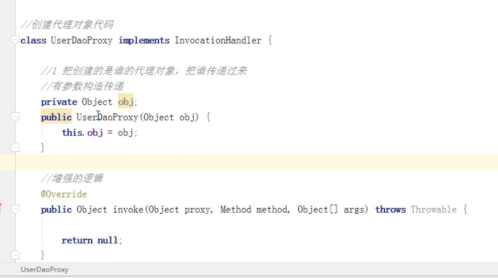

AOP术语
---

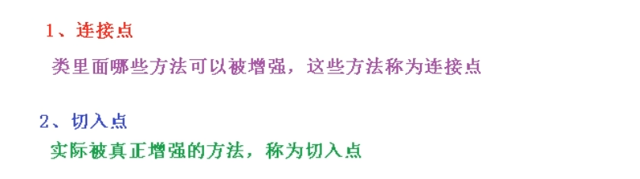

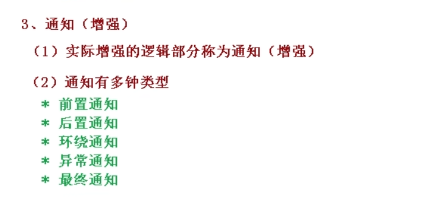

