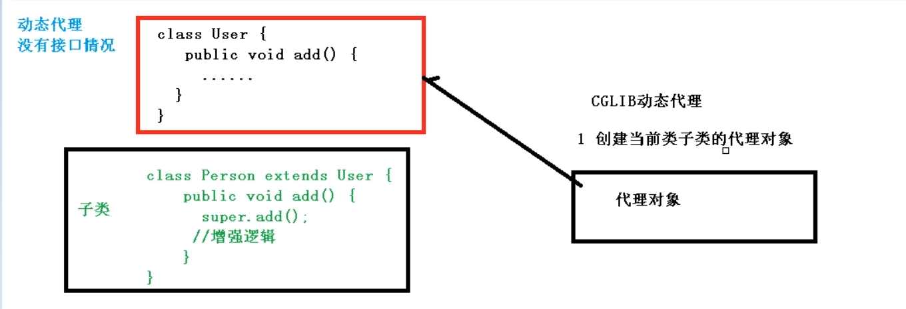
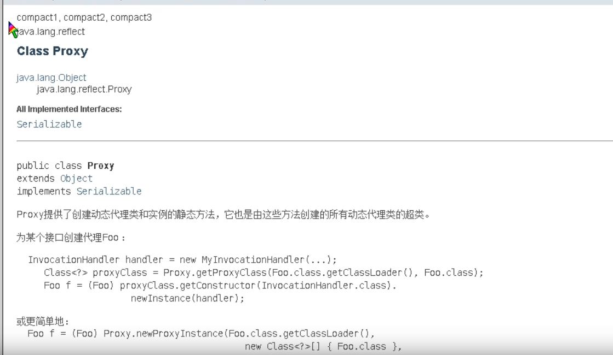
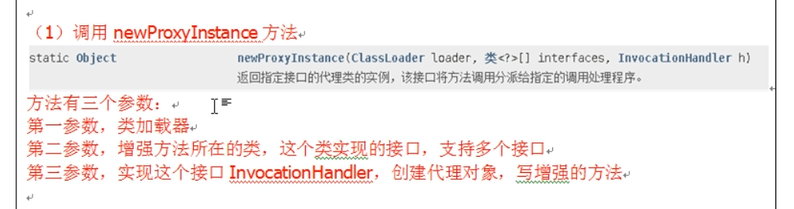
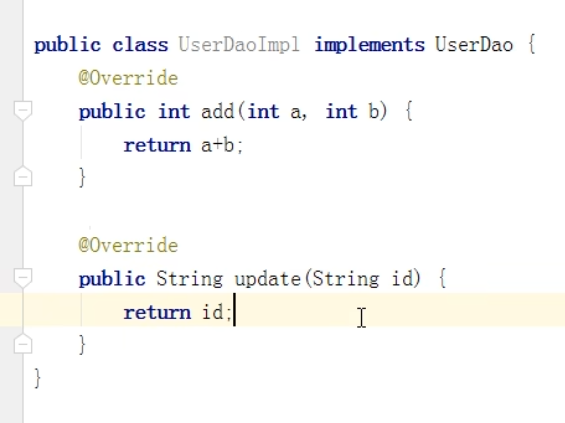
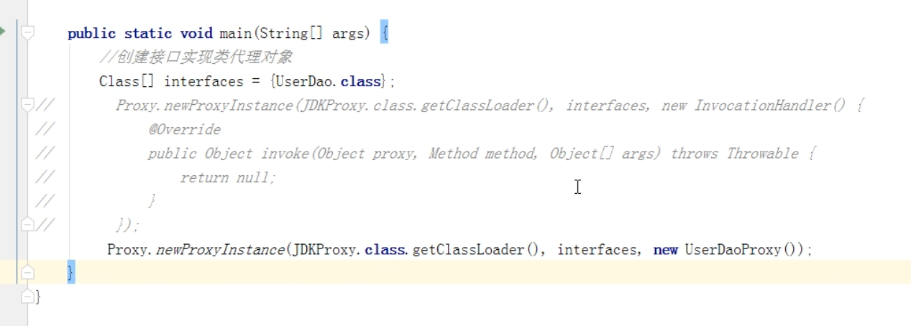
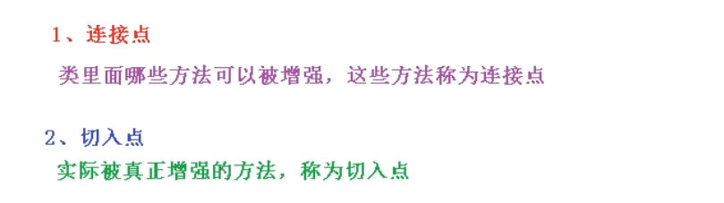
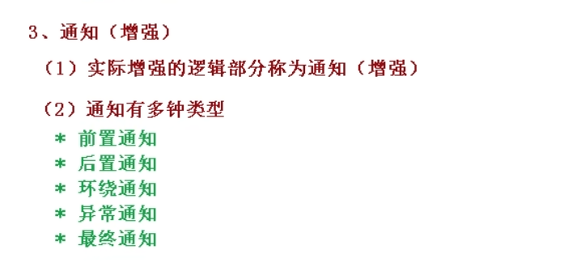
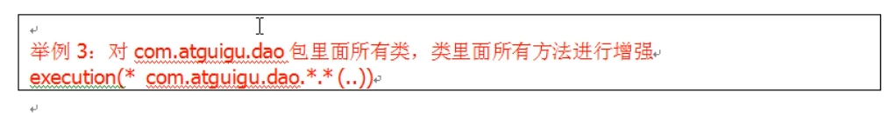

AOP 
---

面向切面编程

类实现了接口 使用JDK生成代理类
---

JDK代理类非new出来的

创建的是接口实现类 作为代理类增强逻辑

没有实现接口 使用CJLib实现代理类
---

创建的是类的子类 作为代理类增强逻辑

AOP 基于JDK的实现原理
---

使用jdk动态代理，使用proxy类里的方法创建代理对象

类加载器

增强方法所在类的接口，接口可以有多个

invocationHandler 实现这个接口 创建代理对象 写增强的方法

实现步骤
---

接口

实现类

创建代理对象 实现 invocationHandler

AOP术语
---

AspectJ
---

Aspect并不是Spring aop的组成部分，是独立的AOP框架

AspectJ切入 引入包

表达式

spring aop 和AspectJ的对比
----

