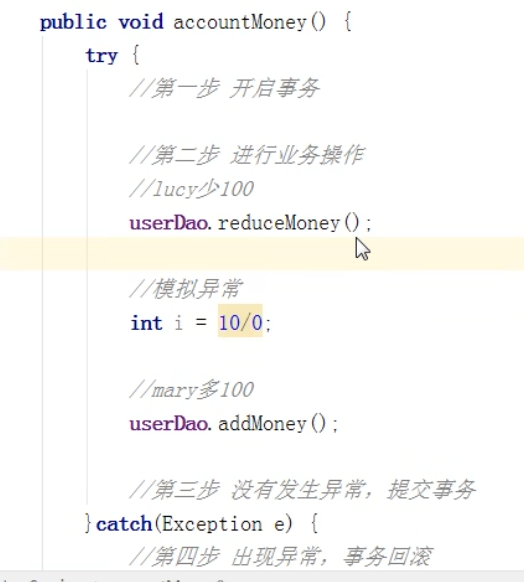
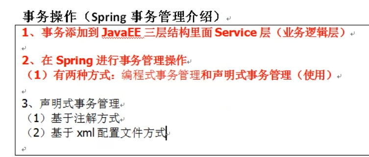
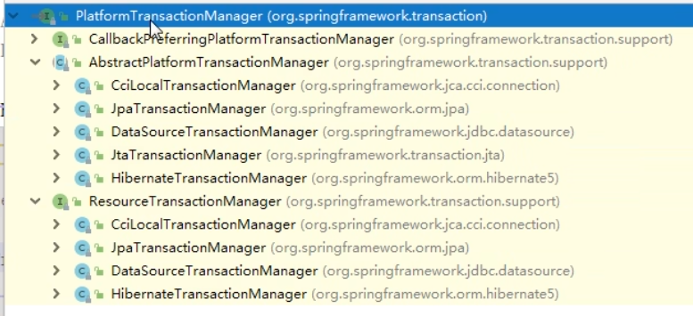
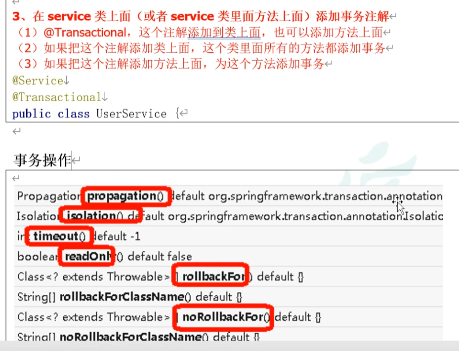
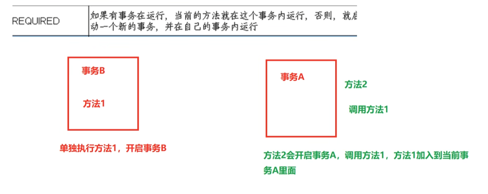

事务特性
---

ACID

原子性

一致性

隔离性

持久性

声明式事务和编程式事务
---

编程式事务由业务代码自己实现 如 try catch 方式

声明式事务由spring提供，底层使用是AOP

spring事务管理中

最顶层的接口是platform transaction manager

代表事务管理器 针对不同框架提供了不同实现类

@Transaction
---

注解式的 声明式事务管理

spring 事务的传播方式
---

required 方法1开始事务 方法2开始事务 1调用2 方法2加入或者说也在方法1事务中

required new 

