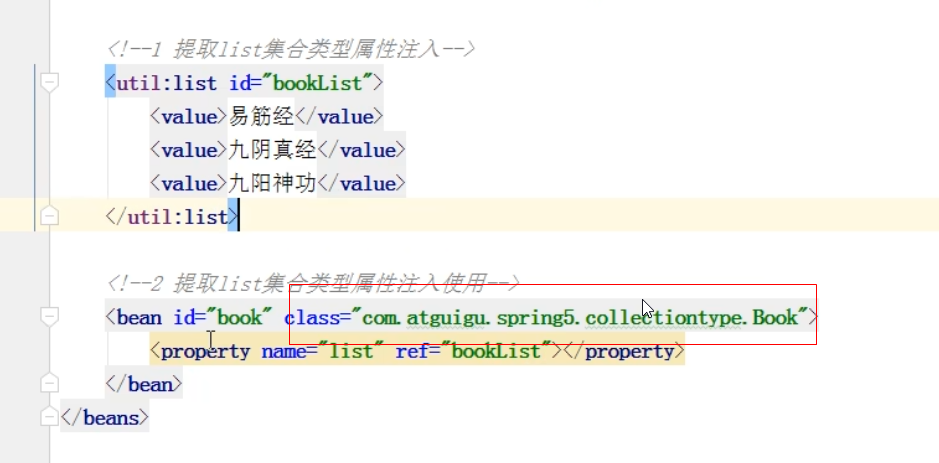
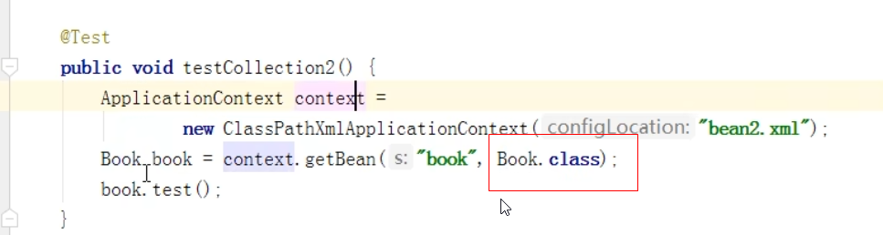

spring中的两种bean
---
一种是普通的bean，另一种是工厂bean（FactoryBean）

*   普通的bean 配置文件中定义什么类型 class 就返回什么类型

*   工厂bean 配置文件中定义的类型 class 和返回类型可以不一样

创建一个类 让这个类作为工厂bean，实现的接口FactoryBean

实现factoryBean中的接口，在实现的方法中定义返回的bean类型