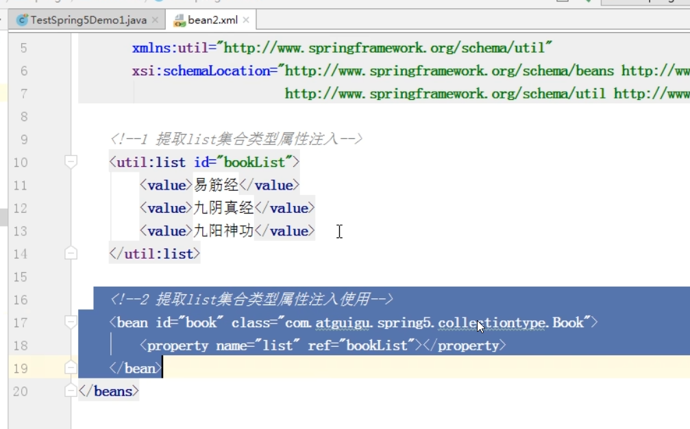
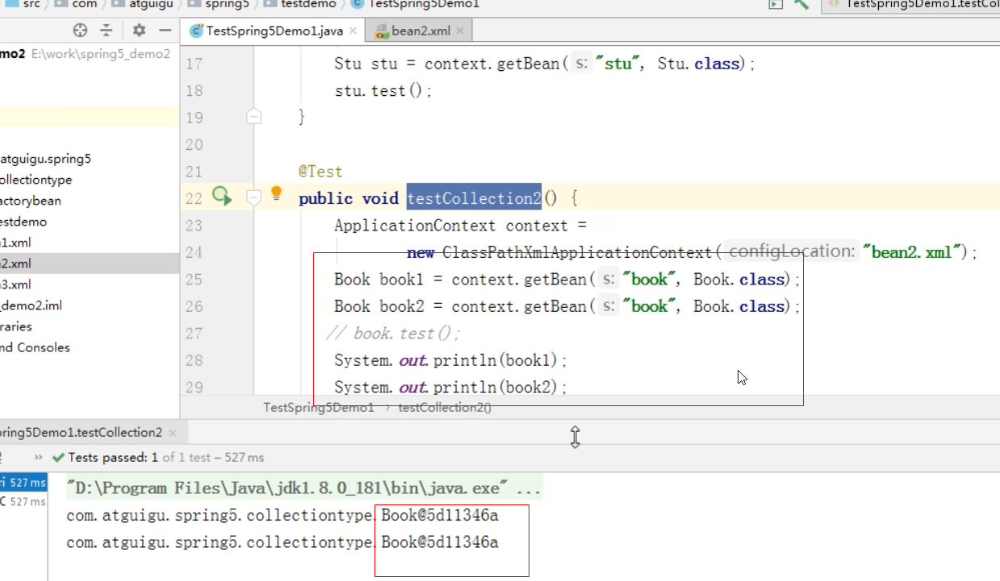
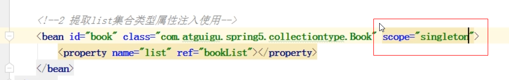
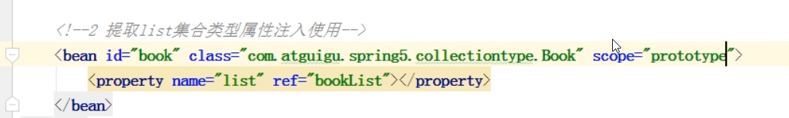
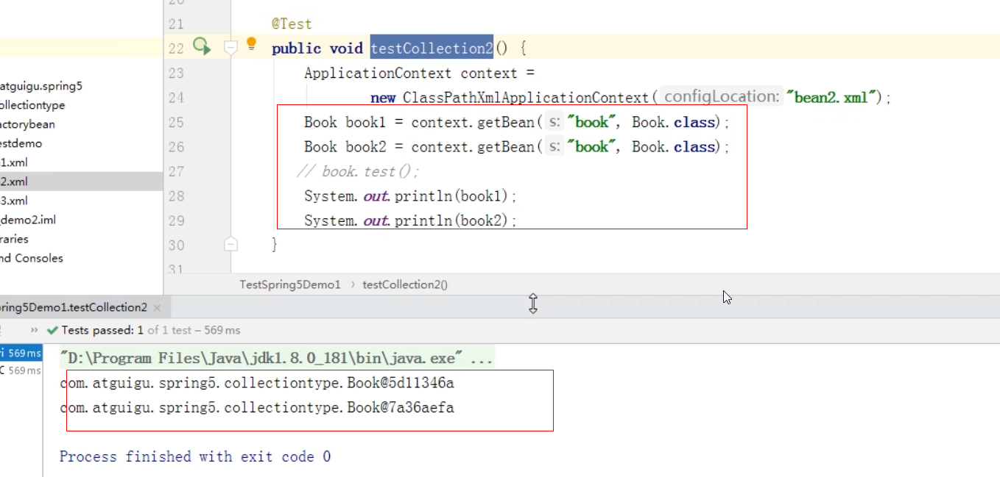

1.在spring中 可以设置bean实例还是多实例

2.默认情况下，创建的bean是单实例对象 如下

如何设置单实例还是多实例
---
通过bean的属性scope 设置 默认是singleton 可选prototype（原型）

修改为prototype后效果如下

设置singleton时 applicationContext加载配置文件时就会创建一个单实例对象

设置prototype时 applicationContext加载配置文件时不会创建对象 只有在调用getBean()方法才会创建一个多实例对象