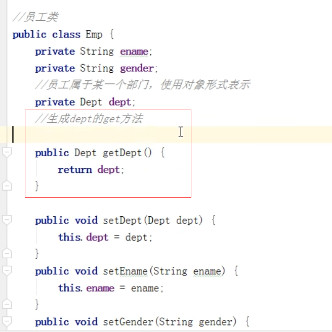
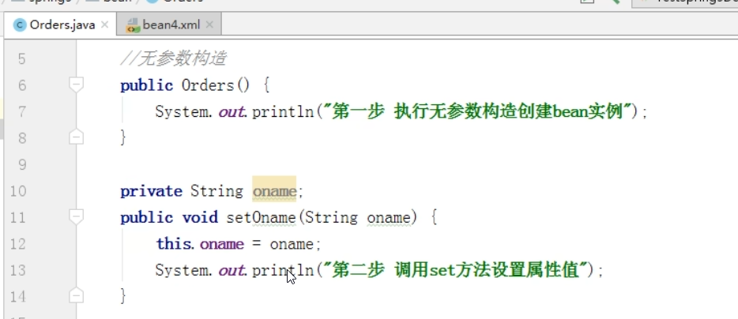
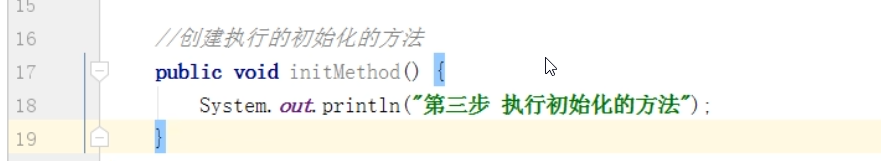
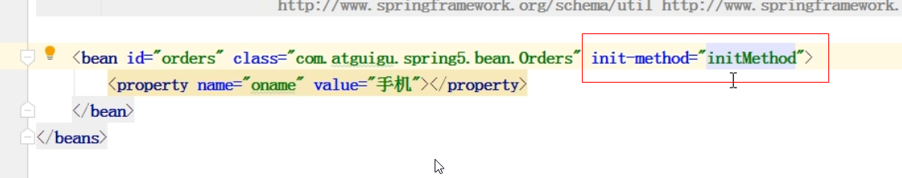
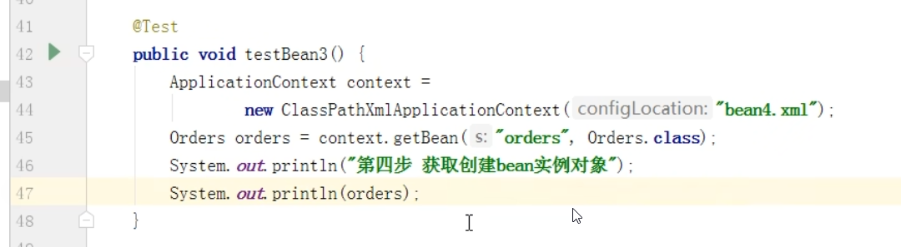
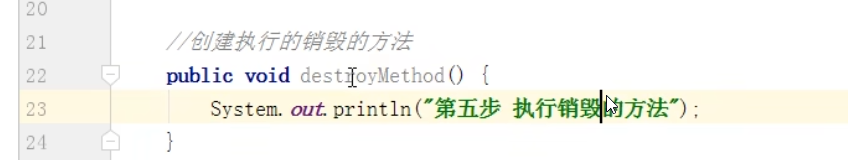
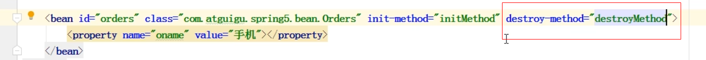
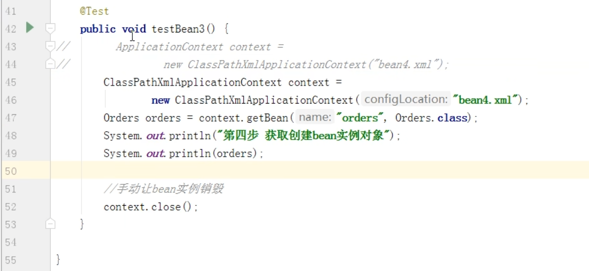
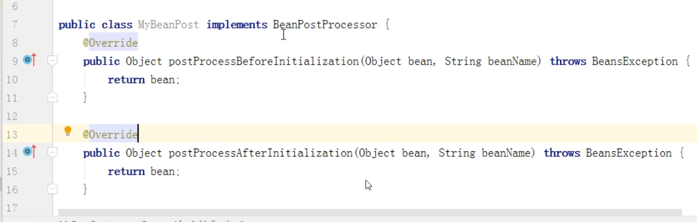
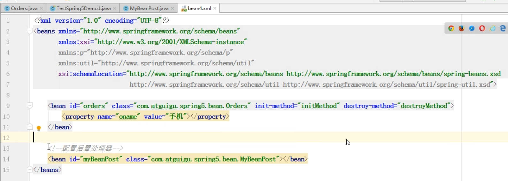

对象的创建到销毁的过程
---

bean的生命周期

1. 通过构造器 无参构造方法 创建bean实例

2. 为bean的属性来设置值 和 对其他bean的引用（调用set方法），如下图的setDept(Dept dept)

3.  调用bean的初始化方法（需要配置初始化的方法）

4.  bean可以使用（对象获取到了）

5.  当容器关闭时，调用bean的销毁方法（需要配置销毁的方法）

bean的后置处理
---

1. 通过构造器 无参构造方法 创建bean实例

2. 为bean的属性来设置值 和 对其他bean的引用（调用set方法），如下图的setDept(Dept dept)

3.  **把bean实例传递给bean后置处理器的方法** BeanPostProcessor.postProcessBeforeInitialization()

4.  调用bean的初始化方法（需要配置初始化的方法）

5.  **把bean实例传递给bean后置处理器的方法** BeanPostProcessor.postProcessAfterInitialization()

6.  bean可以使用（对象获取到了）

7.  当容器关闭时，调用bean的销毁方法（需要配置销毁的方法）

演示添加bean后置处理器
---

实现接口BeanPostProcessor，创建后置处理器

