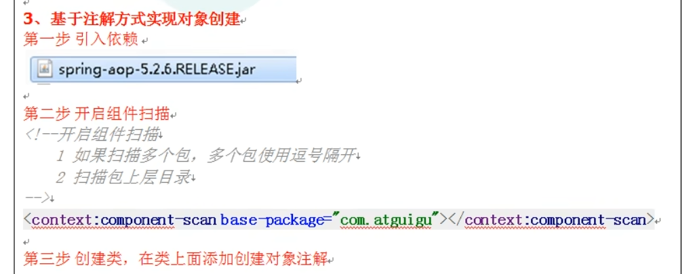
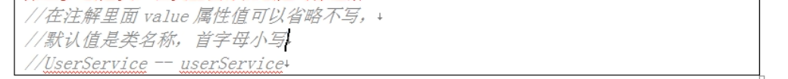
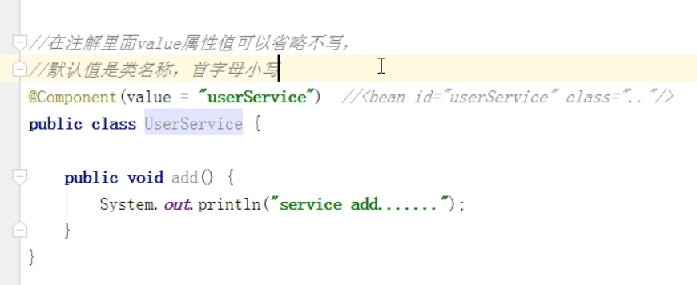
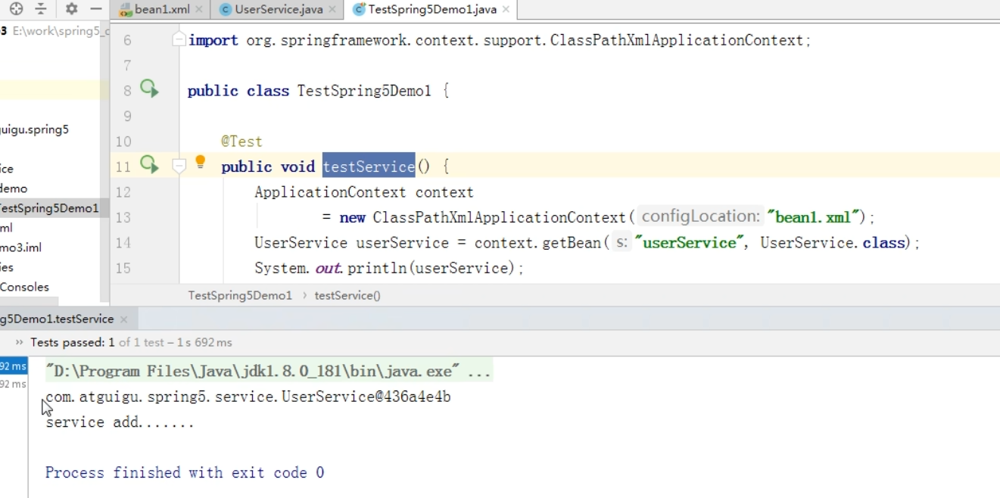

什么是注解？
---

*   注解是代码中的特殊标记

*   可以在方法，属性，类上使用

*  使用注解的目的 比xml配置更加简洁 优雅 一目了然

spring管理bean创建对象的注解 这四个功能是一样的 都可以创建bean
---

@Component

@Service

@Controller

@Repository

第一步 引入spring aop依赖 

第二步 component-scan 扫描包路径

第三步 创建对象 增加注解

