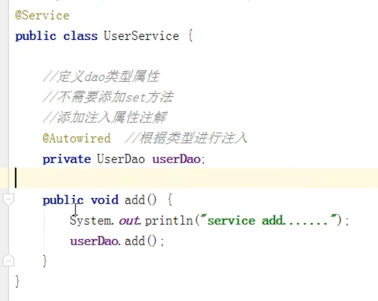
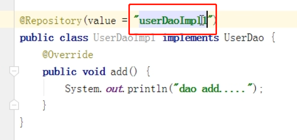
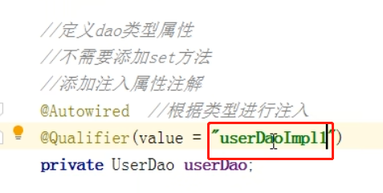

实现属性注入的注解
---

*   @Autowire(自动装配)
    
    根据属性类型自动进行装配

    

*   @Qualifier

    translate: 击败对手可进入某竞赛的)合格者; 预选赛; 资格赛; 外围赛; 修饰词(尤指形容词或副词

    根据属性名称注入

    因为@Autowired放在interface上 如果有多个实现类 无法确定是哪个实现类

    

    

*   @Resource

    可以根据属性名 也可以 根据 属性类型 注入

