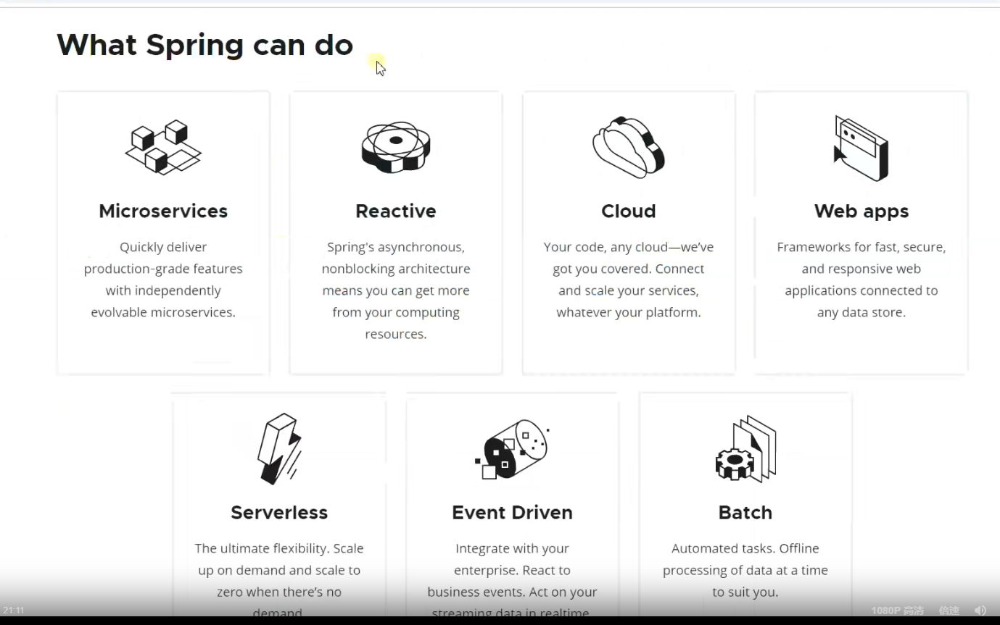
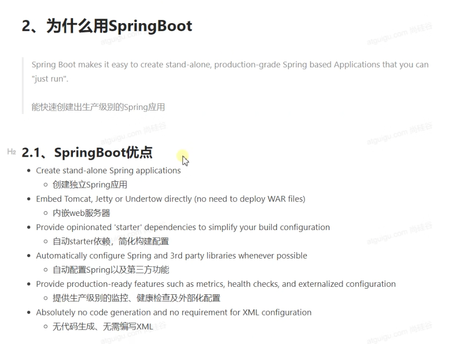

Spring Boot 2 学习笔记（上）：

    https://blog.csdn.net/u011863024/article/details/113667634

Spring Boot 2 学习笔记（下）：

    https://blog.csdn.net/u011863024/article/details/113667946

what spring can do ?

micro（mai kou）（极小的，微小的；微观的） services 

    微服务 将功能拆分 为 一个个微服务

reactive （rui ai ke ti wu）(反应的；电抗的；反动的) 响应式编程

    响应式编程 通过异步非阻塞的方式 构建一个异步数据流 占用服务器少量线程 构建高吞吐量的开发

cloud 
    
    分布式应用

web apps  

    使用spring MVC 开发web应用

serverless

    无服务 函数即服务 (FaaS) 

event driven(zui wen)

    事件驱动 分布式系统 实时的数据流 再通过reactive 完成高吞吐量的业务

batch

    批处理

spring boot 开箱即用 快速创建一个生产级别的spring应用

