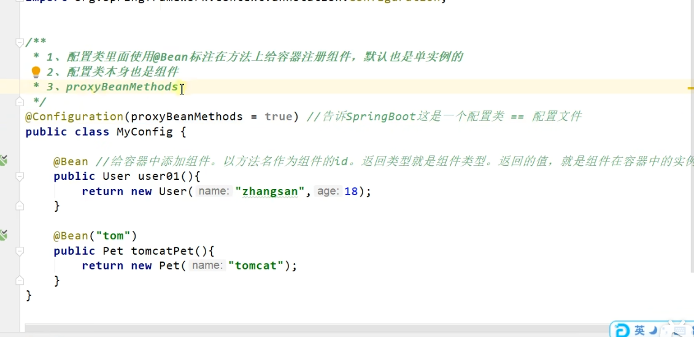

@SpringBootApplication这一个注解内包含了下面三个注解

    @SpringBootApplication
    等同于
    @SpringBootConfiguration
    @EnableAutoConfiguration
    @ComponentScan("com.lun")

spring boot 所有的自动配置功能 都在 spring-boot-configuration

@Configuration