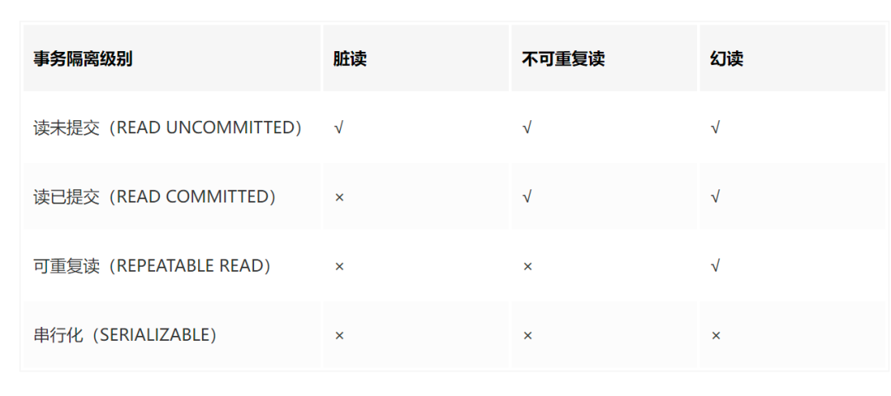
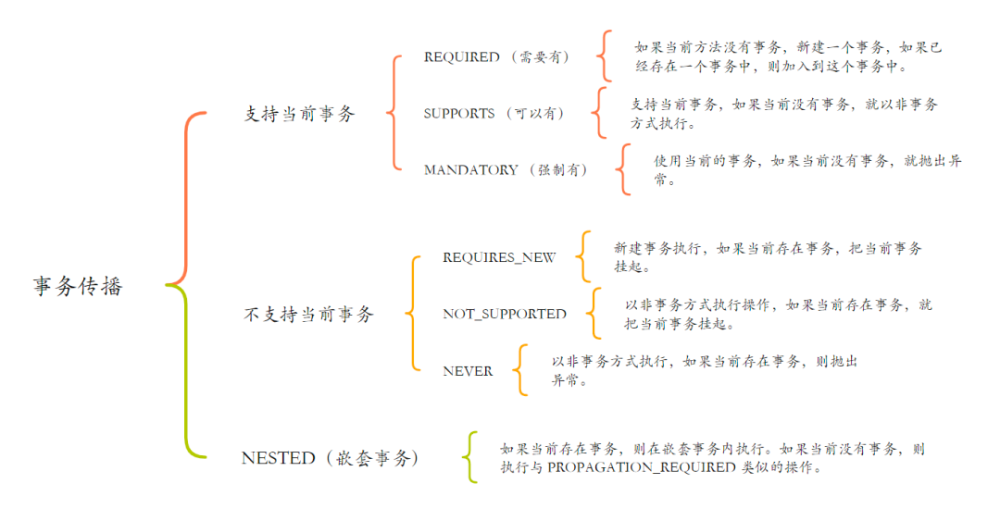
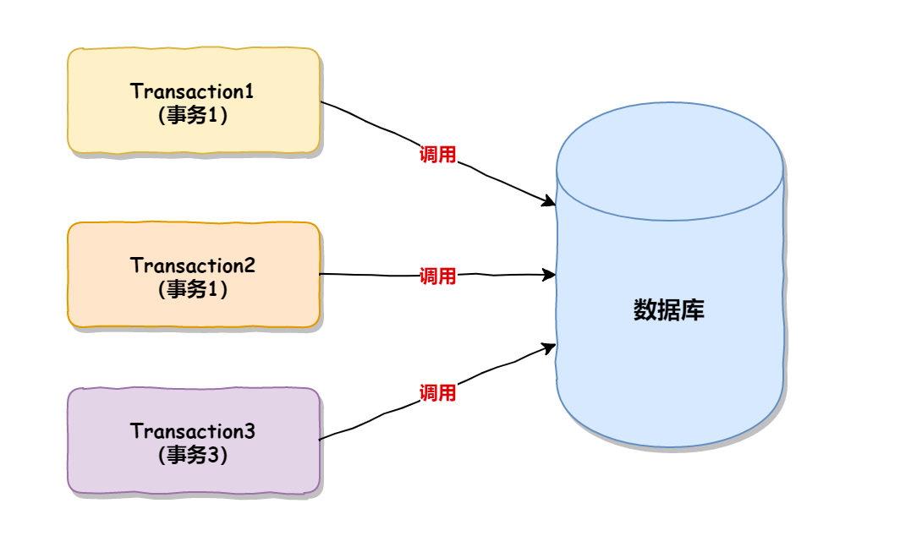
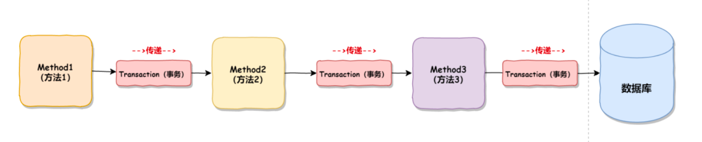

事务隔离级别和事务传播机制都是对事务行为的规范，但二者描述的侧重点却不同。

本文这里所说的事务隔离级别和事务传播机制指的是 Spring 框架中的机制。

1、事务隔离级别
---

事务隔离级别是对事务 4 大特性中隔离性的具体体现，使用事务隔离级别可以控制并发事务在同时执行时的某种行为。

比如，有两个事务同时操作同一张表，此时有一个事务修改了这张表的数据，但尚未提交事务，那么在另一个事务中，

要不要（或者说能不能）看到其他事务尚未提交的数据呢？

这个问题的答案就要看事务的隔离级别了，不同的事务隔离级别，

对应的行为模式也是不一样的（有些隔离级别可以看到其他事务尚未提交的数据，有些事务隔离级别看不到其他事务尚未提交的数据），

这就是事务隔离级别的作用。

Sping 中的事务隔离级别有 5 种，它们分别是：

DEFAULT：

    Spring 中默认的事务隔离级别，以连接的数据库的事务隔离级别为准；

READ_UNCOMMITTED：

    读未提交，也叫未提交读，该隔离级别的事务可以看到其他事务中未提交的数据。

    该隔离级别因为可以读取到其他事务中未提交的数据，而未提交的数据可能会发生回滚，

    因此我们把该级别读取到的数据称之为脏数据，把这个问题称之为脏读；

READ_COMMITTED：

    读已提交，也叫提交读，该隔离级别的事务能读取到已经提交事务的数据，因此它不会有脏读问题。

    但由于在事务的执行中可以读取到其他事务提交的结果，所以在不同时间的相同 SQL 查询中，

    可能会得到不同的结果，这种现象叫做不可重复读；

REPEATABLE_READ：

    可重复读，它能确保同一事务多次查询的结果一致。但也会有新的问题，比如此级别的事务正在执行时，

    另一个事务成功的插入了某条数据，但因为它每次查询的结果都是一样的，所以会导致查询不到这条数据，

    自己重复插入时又失败（因为唯一约束的原因）。明明在事务中查询不到这条信息，

    但自己就是插入不进去，这就叫幻读 （Phantom Read）；

SERIALIZABLE：

    串行化，最高的事务隔离级别，它会强制事务排序，使之不会发生冲突，从而解决了脏读、

    不可重复读和幻读问题，但因为执行效率低，所以真正使用的场景并不多。

所以，相比于 MySQL 的事务隔离级别，Spring 中多了一种 DEFAULT 的事务隔离级别。

事务隔离级别与问题的对应关系如下：
---
脏读：

    一个事务读取到了另一个事务修改的数据之后，后一个事务又进行了回滚操作，从而导致第一个事务读取的数据是错误的。

不可重复读：

    一个事务两次查询得到的结果不同，因为在两次查询中间，有另一个事务把数据修改了。
幻读：

    一个事务两次查询中得到的结果集不同，因为在两次查询中另一个事务有新增了一部分数据。

Spring 中，事务隔离级别可以通过 @Transactional(isolation = Isolation.DEFAULT) 来设置。

2、事务传播机制
---

Spring 事务传播机制是指，包含多个事务的方法在相互调用时，事务是如何在这些方法间传播的。

Spring 事务传播机制可使用 @Transactional(propagation=Propagation.REQUIRED) 来设置，

Spring 事务传播机制的级别包含以下 7 种：

Propagation.REQUIRED：

    默认的事务传播级别，它表示如果当前存在事务，则加入该事务；如果当前没有事务，则创建一个新的事务。

Propagation.SUPPORTS：

    如果当前存在事务，则加入该事务；如果当前没有事务，则以非事务的方式继续运行。

Propagation.MANDATORY：

    （mandatory：强制性）如果当前存在事务，则加入该事务；如果当前没有事务，则抛出异常。

Propagation.REQUIRES_NEW：

    表示创建一个新的事务，如果当前存在事务，则把当前事务挂起。

    也就是说不管外部方法是否开启事务，Propagation.REQUIRES_NEW 修饰的内部方法会新开启自己的事务，

    且开启的事务相互独立，互不干扰。

Propagation.NOT_SUPPORTED：

    以非事务方式运行，如果当前存在事务，则把当前事务挂起。

Propagation.NEVER：

    以非事务方式运行，如果当前存在事务，则抛出异常。

Propagation.NESTED：

    如果当前存在事务，则创建一个事务作为当前事务的嵌套事务来运行；

    如果当前没有事务，则该取值等价于 PROPAGATION_REQUIRED。

以上 7 种传播机制，可分为以下 3 类：

总结
---

从上述的介绍中可以看出，事务隔离级别描述的是多个事务同时执行时的某种行为，它们的调用流程如下：

图片而事务传播机制是描述，多个包含了事务的方法在相互调用时事务的传播行为，它们的调用流程如下：

图片所以事务隔离级别描述的是纵向事务并发调用时的行为模式，而事务传播机制描述的是横向事务传递时的行为模式。