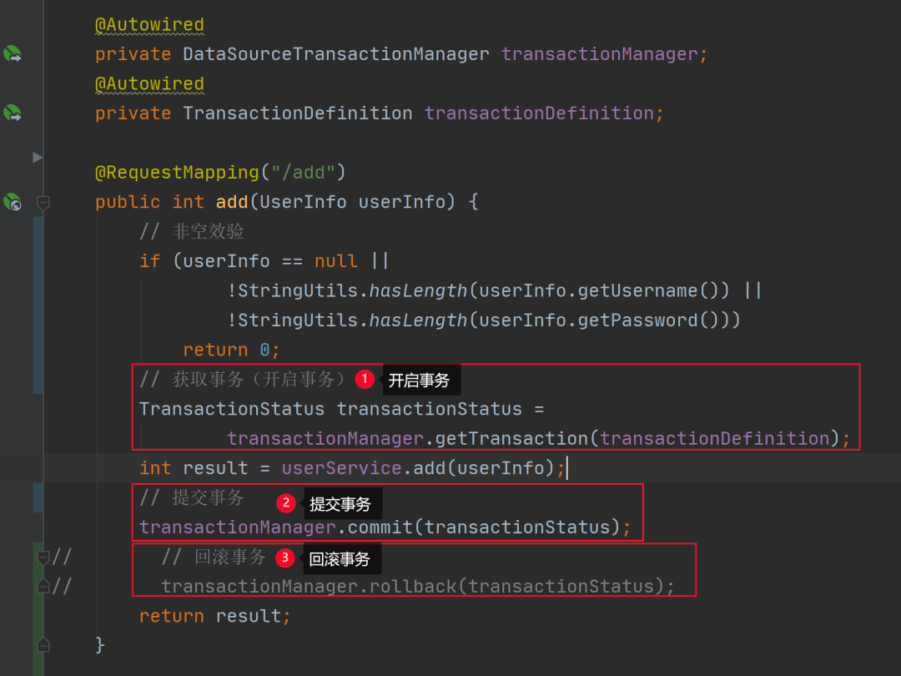

在 Spring Boot 中操作事务有两种方式：编程式事务或声明式事务，接下来我们一起来看二者的具体实现。

1.编程式事务
---
在 Spring Boot 中实现编程式事务又有两种实现方法：

使用 TransactionTemplate 对象实现编程式事务；

使用更加底层的 TransactionManager 对象实现编程式事务。

它们的具体实现代码如下。

1.1 TransactionTemplate 使用
---
要使用 TransactionTemplate  对象需要先将 TransactionTemplate 注入到当前类中 ，

然后再使用它提供的 execute 方法执行事务并返回相应的执行结果，

如果程序在执行途中出现了异常，那么就可以使用代码手动回滚事务，具体实现代码如下：

1.2 TransactionManager 使用
---
TransactionManager 实现编程式事务相对麻烦一点，

它需要使用两个对象：TransactionManager 的子类，加上 TransactionDefinition 事务定义对象，

再通过调用 TransactionManager 的 getTransaction 获取并开启事务，

然后调用 TransactionManager 提供的 commit 方法提交事务，

或使用它的另一个方法 rollback 回滚事务，它的具体实现代码如下：

从上述代码可以看出，使用编程式事务更加灵活，但写法比较麻烦。

2.声明式事务
---
声明式事务的实现比较简单，只需要在方法上或类上添加 @Transactional 注解即可，

当加入了 @Transactional 注解就可以实现在方法执行前，自动开启事务；

在方法成功执行完，自动提交事务；如果方法在执行期间，出现了异常，那么它会自动回滚事务。

它的具体使用如下：

当然，@Transactional 支持很多参数的设置，它的参数设置列表如下：

参数的设置方法如下：

总结
---
本文我们介绍了两种事务的实现方式：

编程式事务或声明式事务。其中编程式事务又分为两种实现：

    使用 TransactionTemplate 对象或更加底层的 TransactionManager 对象分别实现编程式事务，

    它们的优点是灵活性更高，可以在任何代码片段上添加事务；

    而声明式事务的实现更加简单，只需要在类或方法上添加 @Transactional 注解即可实现事务的自动开启和提交（以及回滚）。