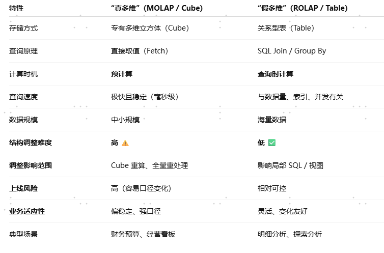

# “真多维”：MOLAP (Multidimensional OLAP)

Oracle Essbase , IBM Cognos TM1 , SQL Server Analysis Services。

它的数据不再是以“表”的形式存储，而是以一种专有的**多维数组（Cube/立方体）**格式存储。

## 优点：

速度极快： 数据在存储的时候，已经按照维度（时间、地区、产品）把结果预先算好（Pre-aggregation）填在格子里了。

因为结果是预先算好的，用户查询时，系统只需要直接去那个格子里“读数”就行，几乎不需要现场计算。

计算功能强：由于结构特殊，它非常擅长处理复杂的同环比、财务预算、父子节点汇总。

## 缺点：

数据膨胀：预计算意味着存储空间爆炸。如果你有 10 个维度，把所有组合都算一遍，数据量可能比原始数据大几十倍。

更新慢：每次有新数据进来，整个 Cube 往往需要重新“跑数”（Process），这可能需要几个小时。

# “假多维”：ROLAP (Relational OLAP)

MicroStrategy, SAP BW (部分模式), 以及现在的 ClickHouse, Doris, StarRocks 其实本质上也是走的这条路。

## 为什么叫“假”？（逻辑上的多维）

数据在硬盘里依然是二维表（关系型数据库），通常采用**星型模型（Star Schema）**或雪花模型。

所谓的“多维”，只是在表上面盖了一层**“语义层”**（Metadata）。在这个层里，你定义了什么是维度、什么是指标。

当你拖拽报表时，系统会把你的多维操作翻译成巨复杂的 SQL 语句，去底层的关系型数据库里现场跑。

## 优点（灵活）：

数据实时：因为没有“预计算”的过程，底表数据一更新，报表立马能看到。

容量无限：只要你的数据库存得下，它就能分析，适合海量明细数据（TB/PB 级）。

## 缺点（依赖性能）：

查询可能慢：如果底下的数据库不够快，或者 SQL 没写好，跑个报表可能要等几十秒甚至超时。

# 对比表

