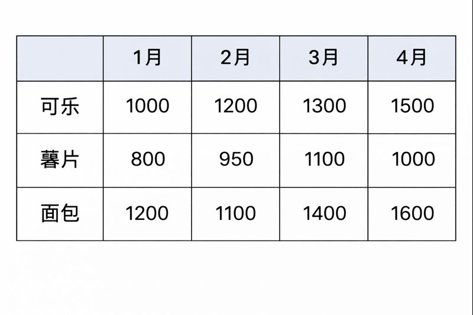
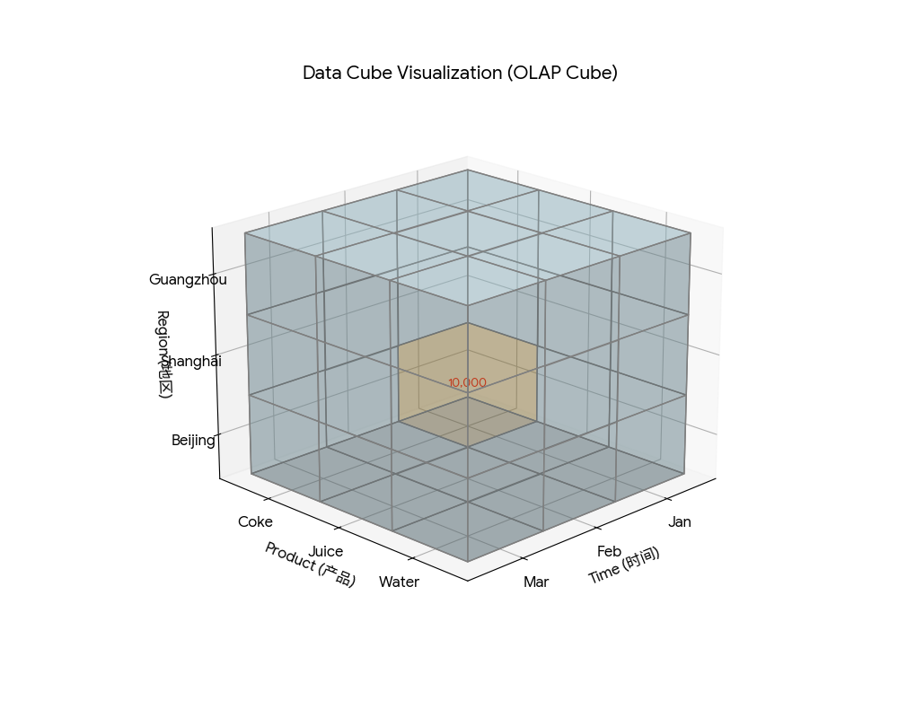

# 一 为什么要发明 Cube？

你是一家大型连锁超市的老板。你手里的原始数据（也就是关系型数据库里的表）就像是一叠长长的购物小票。

这张小票（表）可能有几亿行：

2025-12-01，张三，买了瓶可乐，3元，北京店 
2025-12-01，李四，买了包薯片，5元，上海店 
...

## 如果你问：“我想知道去年12月，北京店卖可乐的总销售额是多少？

### 没有 Cube 时（传统数据库）：

电脑必须把这几亿张小票一张张翻一遍，找到所有同时符合“12月”、“北京”、“可乐”的小票，然后用计算器把金额加起来。这需要很久（几十秒甚至几分钟）。

### 有了 Cube 时：

电脑不需要翻小票了。它直接拿出一个早就写好的小本子，翻到第 10 页，上面直接写着：“12月-北京-可乐：100万”。你一问，它 0.01 秒就告诉你答案。

所以，Cube 的本质就是：预先算好的答案集。

# 二 Cube 到底长什么样？（从 2D 到 3D）

为了存这些“预先算好的答案”，我们需要一个特殊的结构。

## 二维视角（Excel 表格）

假如你只关心时间和产品两个角度（维度）：

横轴（X轴）：1月、2月、3月...

纵轴（Y轴）：可乐、薯片、面包...

交叉的格子：就是销售额。

这很好理解，这就是一张二维表。

## 三维视角（真正的 Cube）

现在，你想加入地区（北京、上海、广州）这个角度。二维表放不下了，我们要把它变成立体的。

这就变成了一个魔方（立方体）：

X轴：时间

Y轴：产品

Z轴：地区

在这个魔方里，每一个小方块（Cell），都代表一个唯一的交叉点：

坐标：（1月，可乐，北京） 格子里的值：10,000元

这就是 Cube。它把所有可能的组合，都预先变成了魔方里的小格子，并把数填进去了。

# 三 揉碎了看内部结构（维度与度量）

要构建这个 Cube，必须有两个核心要素：

## 维度 (Dimensions) —— 看问题的角度

也就是魔方的“轴”。

层级（Hierarchy）：维度通常是可以“伸缩”的。

时间维度：年 -> 季度 -> 月 -> 日

地区维度：中国 -> 江苏 -> 苏州 -> 吴中区

Cube 的厉害之处在于，它不仅算了“日”的数据，连“月”、“年”的数据也顺便帮你算好存起来了。

## 度量 (Measures) —— 里的数值

也就是魔方小格子里填的那个数字。

通常是：销售额、成本、利润、销量。

# 四 玩转 Cube（切片、切块、钻取）

既然数据已经变成了一个魔方，分析数据就变成了“切魔方”的游戏：

## 切片 (Slice)：

老板说：“我只看北京的数据。

动作：像切吐司面包一样，把魔方沿着“北京”那一层切下来。你就得到了一张二维表（时间和产品）。

## 切块 (Dice)：

老板说：“我只看第一季度，华东区的电子产品。”

动作：在魔方里挖出一小块长方体。

## 钻取 (Drill-down)

老板说：“2025年的数据不错，帮我看看1月份怎么样，再看看1月1号怎么样。”

动作：从“年”这个粗粒度，一层层点进去看“日”这个细粒度。因为 Cube 早就把年、月、日的数都算好了，所以怎么点都是秒开。

## 旋转 (Pivot)

动作：把魔方转个身。本来横轴是时间，转一下，横轴变成地区。

# 五 N 维 Cube（超立方体）

你可能会问：“我有 10 个维度怎么办？时间、产品、地区、客户类型、支付方式、销售渠道……”

虽然画图画不出来（人类想象不出 4 维以上的物体），但在计算机里，原理是一样的。它就是一个 N 维的超立方体。

你只要给出一个 10 维坐标： (2025年, 可乐, 北京, VIP客户, 微信支付, 线上渠道...)

Cube 就能立即定位到那个点，给你数值。