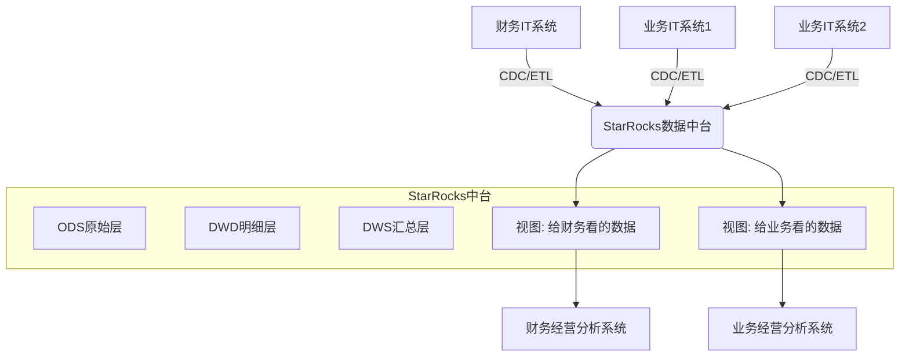

# 问题

财务需要业务的数据进行财务侧经营分析 

业务也需要财务的数据做业务侧经营分析 

我们有财务的经营分析系统，但是只做分析，源数据不在财务经营分析系统在财务侧的IT系统

同理 

业务也有业务的经营分析系统，也是只做分析，业务的源数据也是在业务侧的IT系统中 

业务有很多, 这种情况下，实现方案分为两种： 

一 财务的经营分析系统和业务的经营分析系统都通过数据中台进Starrocks中间库， 各自从Starrocks中取 

二 财务的经营分析系统和业务的经营分析系统都开发接口，从Starrocks中获取到 传给对方

# Gemini-3

这是一个非常经典的**“数据孤岛” vs “数据集成”**的架构选择题。

直接给你结论：**请毫不犹豫地选择【方案一】（基于 StarRocks 的数据中台/仓库模式）。**

对于**“经营分析”**这种场景（数据量大、维度多、查询复杂），**方案二（API 接口模式）是绝对的架构大坑**，走下去会非常痛苦。

我来为你深度对比一下这两个方案，并告诉你为什么方案二行不通。

---

### 1. 为什么【方案一】（StarRocks 共享模式）是正解？

你的需求核心是 **OLAP（联机分析）**，而不是 **OLTP（联机交易）**。

* **架构逻辑**：
1. **汇聚**：通过 ETL/CDC 工具（如 Flink/DataX），把“财务IT系统”和“业务IT系统”的**源数据**实时/定时同步到 StarRocks。
2. **分层**：在 StarRocks 内部建立数仓分层（ODS -> DWD -> DWS）。
3. **共享**：
* **财务分析系统**：直接连接 StarRocks，查询 `业务宽表` + `财务宽表`。
* **业务分析系统**：直接连接 StarRocks，查询 `财务宽表` + `业务宽表`。

* **优点**：
* **性能爆炸**：StarRocks 擅长多表关联（Join）。财务分析往往需要把“财务凭证”和“业务订单”关联起来看毛利。如果在 StarRocks 里做，是**秒级**；如果用接口传，需要把两个大表拉到应用内存里算，会 OOM（内存溢出）。
* **口径统一**：大家都在同一个库里看数。避免了“业务系统传给财务的数据”和“业务系统自己看的数据”不一致的扯皮现象。
* **扩展性强**：你说“业务有很多”。在方案一里，新增一个业务线，只需要把数据接入 StarRocks 即可，**财务分析系统不需要改一行代码**，表里自动多了一种业务类型的数据。

---

### 2. 为什么【方案二】（API 接口互传）是深坑？

方案二典型的思维误区是用做**业务系统（交易）的思路去做数据系统（分析）**。

* **致命缺陷 A：海量数据传输瓶颈**
* **场景**：财务要做年度经营分析，需要拉取业务侧过去 3 年的所有订单明细（可能是几千万行）。
* **后果**：接口怎么设计？
* 一次性返回？**超时、卡死**。
* 分页返回？财务系统要写个循环调几万次接口，网络开销巨大，**慢到无法接受**。

* **结论**：HTTP 接口不适合传输海量分析数据（Bulk Data）。

* **致命缺陷 B：复杂的“笛卡尔积”**
* **场景**：业务侧有 10 个子系统（销售、采购、库存...）。
* **后果**：
* 财务系统需要对接 10 个接口。
* 财务如果想把“销售”和“库存”结合分析，还得自己在内存里写代码拼数据。

* **结论**：把数据库该干的 `Join` 工作硬塞给 Java/Go 接口层去干，这是架构上的“反模式”。

* **致命缺陷 C：数据时效性与一致性**
* 接口调用那一刻的数据，和上一秒的数据可能就不一样了。当财务从接口拉完数据，可能业务侧又变了，分析出来的报表永远对不上账。

---

### 3. 如何解决【方案一】中的“安全与权限”顾虑？

通常选择方案二的人，唯一的理由是：**“财务数据太敏感了，不能让业务随便查；业务数据也不能随便给财务看。”**

其实，在 StarRocks 中完全可以通过**“逻辑隔离”**完美解决，不需要物理隔离（接口）：

**解决方案：View（视图） + RBAC 权限控制**

1. **数据入湖**：所有数据进入 StarRocks 的 `Raw_Data` 库（管理员可见）。
2. **为财务建视图**：
* 创建视图 `View_For_Finance`。
* 内容：包含所有财务数据 + **经过脱敏的/聚合的**业务数据（比如只看销售额，不看具体客户电话）。
* 权限：只把这个视图的 `SELECT` 权限赋给“财务分析系统”的账号。

3. **为业务建视图**：
* 创建视图 `View_For_Business`。
* 内容：包含所有业务数据 + **指定公开的**财务分摊数据（比如某事业部的分摊成本，但屏蔽全集团利润）。
* 权限：只把这个视图的 `SELECT` 权限赋给“业务分析系统”的账号。

---

### 4. 总结架构建议

**推荐架构图谱：**

**一句话建议：**
数据是“重”的，逻辑是“轻”的。**不要移动数据去迁就逻辑（API模式），而要移动逻辑去贴近数据（StarRocks模式）。**

