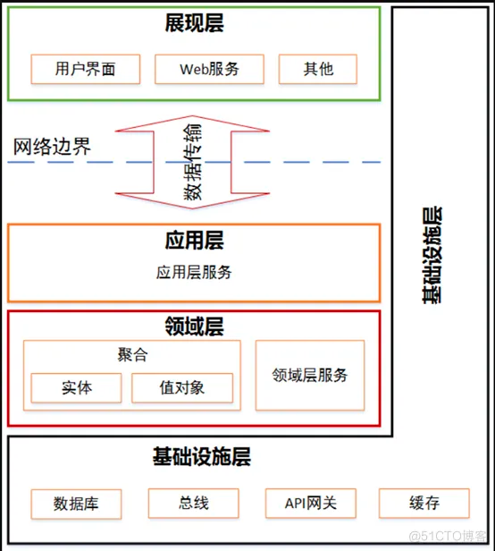
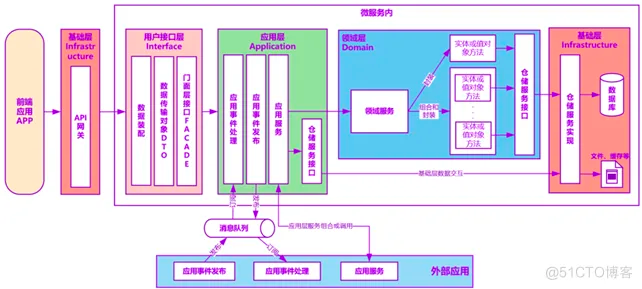
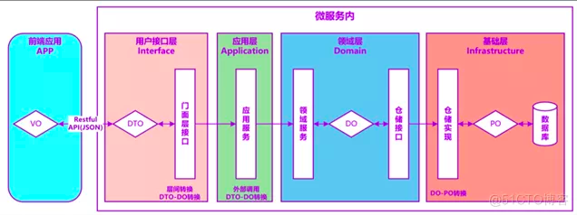
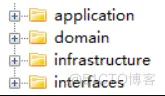
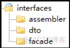
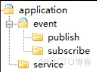
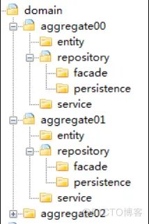
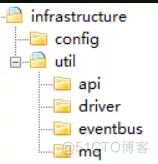

DDD领域分层架构设计
---
DDD分层架构包括：展现层、应用层、领域层和基础层

1、 展现层

    展现层负责向用户显示信息和解释用户指令。

2、 应用层

    应用层是很薄的一层，主要面向用户用例操作，协调和指挥领域对象来完成业务逻辑。
    
    应用层也是与其他系统的应用层进行交互的必要渠道。
    
    应用层服务尽量简单，它不包含业务规则或知识，只为下一层的领域对象协调任务，
    
    使它们互相协作。应用层还可进行安全认证、权限校验、分布式和持久化事务控制或向外部应用发送基于事件的消息等。

3、 领域层

    领域层是软件的核心所在，它实现全部业务逻辑并且通过各种校验手段保证业务正确性。
    
    它包含业务所涉及的领域对象（实体、值对象）、领域服务以及它们之间的关系。
    
    它负责表达业务概念、业务状态以及业务规则，具体表现形式就是领域模型。

4、 基础层

    基础层为各层提供通用的技术能力，
    
    包括：为应用层传递消息、提供API管理，为领域层提供数据库持久化机制。
    
    它还能通过技术框架来支持各层之间的交互。

微服务内有Facade接口、应用服务、领域服务和基础服务，各层服务协同配合，为外部提供服务
---

1、 接口服务

    接口服务位于用户接口层，用于处理用户发送的Restful请求和解析用户输入的配置文件等，并将信息传递给应用层。

2、 应用服务

    应用服务位于应用层。用来表述应用和用户行为，负责服务的组合、编排和转发，负责处理业务用例的执行顺序以及结果的拼装。
    
    应用层的服务包括应用服务和领域事件相关服务。
    
    应用服务可对微服务内的领域服务以及微服务外的应用服务进行组合和编排，
    
    或者对基础层如文件、缓存等数据直接操作形成应用服务，对外提供粗粒度的服务。
    
    领域事件服务包括两类：领域事件的发布和订阅。通过事件总线和消息队列实现异步数据传输，实现微服务之间的解耦。

3、 领域服务

    领域服务位于领域层，为完成领域中跨实体或值对象的操作转换而封装的服务，领域服务以与实体和值对象相同的方式参与实施过程。
    
    领域服务对同一个实体的一个或多个方法进行组合和封装，或对多个不同实体的操作进行组合或编排，对外暴露成领域服务。

    领域服务封装了核心的业务逻辑。实体自身的行为在实体类内部实现，向上封装成领域服务暴露。
    
    为隐藏领域层的业务逻辑实现，所有领域方法和服务等均须通过领域服务对外暴露。
    
    为实现微服务内聚合之间的解耦，原则上禁止跨聚合的领域服务调用和跨聚合的数据相互关联。

4、 基础服务

    基础服务位于基础层。为各层提供资源服务（如数据库、缓存等），

    实现各层的解耦，降低外部资源变化对业务逻辑的影响。
    
    基础服务主要为仓储服务，通过依赖反转的方式为各层提供基础资源服务，

    领域服务和应用服务调用仓储服务接口，利用仓储实现持久化数据对象或直接访问基础资源。

数据视图
---

DDD分层架构中数据对象转换的过程如下图

应用服务通过数据传输对象（DTO）完成外部数据交换。

领域层通过领域对象（DO）作为领域实体和值对象的数据和行为载体。基础层利用持久化对象（PO）完成数据库的交换。

DTO与VO通过Restful协议实现JSON格式和对象转换。

前端应用与应用层之间DTO与DO的转换发生在用户接口层。

如微服务内应用服务需调用外部微服务的应用服务，则DTO的组装和DTO与DO的转换发生在应用层。

领域层DO与PO的转换发生在基础层

微服务代码模型
---

基于DDD的代码模型包括interfaces、application、domain和infrastructure四个层级

Interfaces（用户接口层）：

    本目录主要存放用户接口层代码。前端应用通过本层向应用服务获取展现所需的数据。
    
    本层主要用于处理用户发送的Restful请求和解析用户输入的配置文件等，并将信息传递给Application层。
    
    主要代码形态是数据组装以及Facade接口等。

Application（应用层）：

    本目录主要存放应用层代码。应用服务代码基于微服务内的领域服务或微服务外的应用服务完成服务编排和组合。
    
    为用户接口层提供各种应用数据展现支持。主要代码形态是应用服务和领域事件等。

Domain（领域层）：

    本目录主要存放领域层代码。本层代码主要实现核心领域逻辑，其主要代码形态是实体类方法和领域服务等。

Infrastructure（基础层）：

    本目录存放基础层代码，为其它各层提供通用技术能力、三方软件包、配置和基础资源服务等。

Interfaces（用户接口层）
---

Assembler：

    实现DTO与领域对象之间的相互转换和数据交换。

Dto：

    数据传输的载体，内部不存在任何业务逻辑，通过DTO把内部的领域对象与外界隔离。

Facade：

    提供较粗粒度的调用接口，将用户请求委派给一个或多个应用服务进行处理。

Application（应用层）
---

Event（事件）：

    事件目录包括两个子目录：publish和subscribe。publish目录主要存放微服务内领域事件发布相关代码。

    subscribe目录主要存放微服务内聚合之间或外部微服务领域事件订阅处理相关代码。

    为了实现领域事件的统一管理，微服务内所有领域事件（包括应用层和领域层事件）的发布和订阅处理都统一放在应用层。

Service（应用服务）：

    这里的服务是应用服务。应用服务对多个领域服务或外部应用服务进行封装、编排和组合，对外提供粗粒度的服务。

Domain（领域层）
---

Aggregate（聚合）：

    聚合代码包的根目录，实际项目中以实际业务属性的名称来命名。

    聚合定义了领域对象之间的关系和边界，实现领域模型的内聚。

Entity（实体）：

    存放实体（含聚合根、实体和值对象）相关代码。

    同一实体所有相关的代码（含对同一实体类多个对象操作的方法，如对多个对象的count等）都放在一个实体类中。

Service（领域服务）：

    存放对多个不同实体对象操作的领域服务代码。

    这部分代码以领域服务的形式存在，在设计时一个领域服务对应一个类。

Repository（仓储）：

    存放聚合对应的查询或持久化领域对象的代码，通常包括仓储接口和仓储实现方法。为了方便聚合的拆分和组合，我们设定一个原则：一个聚合对应一个仓储。

特别说明：

    按照DDD分层原则，仓储实现本应属于基础层代码，但为了微服务代码拆分和重组的便利性，

    我们可以把聚合的仓储实现代码放到了领域层对应的聚合代码包内。

    如果需求或者设计发生变化导致聚合需要拆分或重新组合时，我们可以聚合代码包为单位，轻松实现微服务聚合的拆分和组合。

Infrastructure（基础层）
---

Config：

    主要存放配置相关代码。

Util：

    主要存放平台、开发框架、消息、数据库、缓存、文件、总线、网关、第三方类库、通用算法等基础代码，

    可为不同的资源类别建立不同的子目录