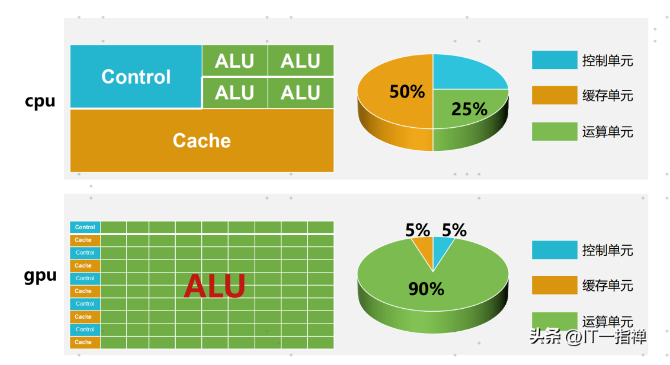
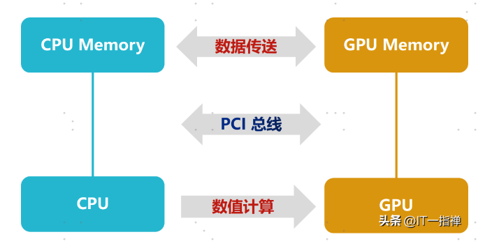
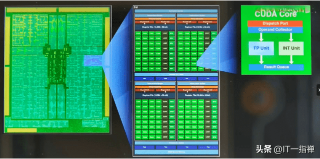

GPU和CPU谁最强呢？
---

这个其实不好说，好点的GPU内部的晶体管数量可以超过CPU，CPU的强项是做逻辑运算，GPU的强项是做数学运算和图形渲染。这就ChatGPT用大量高性能显卡做AI推理的原因。

接下来，我们做个简单的对比。

### 结构组成不同
CPU和GPU都是运算的处理器，在架构组成上都包括3个部分：运算单元ALU、控制单元Control和缓存单元Cache。

但是，三者的组成比例却相差很大。

在CPU中缓存单元大概占50%，控制单元25%，运算单元25%；

在GPU中缓存单元大概占5%，控制单元5%，运算单元90%。

结构组成上的巨大差异说明：CPU的运算能力更加均衡，但是不适合做大量的运算；GPU更适合做大量运算。

这倒不是说GPU更牛X，实际上GPU更像是一大群工厂流水线上的工人，适合做大量的简单运算，很复杂的搞不了。但是简单的事情做得非常快，比CPU要快得多。

相比GPU，CPU更像是技术专家，可以做复杂的运算， 比如逻辑运算、响应用户请求、网络通信等。但是因为ALU占比较少、内核少，所以适合做相对 少量的复杂运算。

### 缓存不同

在CPU里面，大概50%是缓存单元，并且是四级缓存结构；而在GPU中，缓存是一级或者二级的。

### 浮点运算方式不同

CPU性能更加注重线程的性能，在控制部分做的事情较多，这样做就是为了确保控制指令不能中断，在浮点计算上功耗少。

相较于CPU，GPU的结构更为简单，基本上它也只做单精度或双精度浮点运算。GPU的运算速度更快，吞吐量也更高。

### 响应方式不同

CPU基本上是实时响应，采用多级缓存来保障多个任务的响应速度。

GPU往往采用的是批处理的机制，即：任务先排好队，挨个处理。

### GPU对于图形处理

这还是高清的情况下，如果是1090*1080、2K、4K甚至8K的视频渲染，可想而知，这个计算量是何其巨大。尤其是在像游戏这样的实时渲染场景下，显然仅仅依靠CPU渲染是会超时的。

实际上，在屏幕中显示的三维物体都要经过多重的坐标变换，并且物体的表面会受到环境中各种光线的影响，呈现不同的颜色和阴影。这就包括了光线的漫射、折射、透射、散射等。

接下来，我们以英伟达NVIDIA RTX3090 为例，看下GPU是如何进行渲染的。

RTX3090的流式多处理器有10496个，每个内核都有具备整数运算和浮点运算的部分，还有用于在操作数中排队和收集结果的部分。

所谓流式多处理器可以认为是一个独立的任务处理单元，也可以认为一颗GPU包含了10496个CPU同时处理各个图片处理任务。

如下图所示，在GPU中会划分为多个流式处理区，每个处理区包含数百个内核，每个内核相当于一颗简化版的CPU，具备整数运算和浮点运算的功能，以及排队和结果收集功能。

注意，除了流处理器CUDA以外，影响GPU性能的还有

    核心频率：频率越高，性能越强、功耗也越高。
    显示位宽：单位是bit，位宽决定了显卡同时可以处理的数据量，越大越好。
    显存容量：显存容量越大，代表能缓存的数据就越多。
    显存频率：单位是MHz或bps，显存频率越高，图形数据传输速度就越快。

### 总结

一言以蔽之，GPU不管是处理图形渲染、数值分析，还是处理AI推理。底层逻辑都是将极为繁重的数学进行任务拆解，化繁为简。

然后，利用GPU多流处理器的机制，将大量的运算拆解为一个个小的、简单的运算，并行处理。我们也可以认为一个GPU就是一个集群，里面每个流处理器都是一颗CPU，这样就容易理解了。