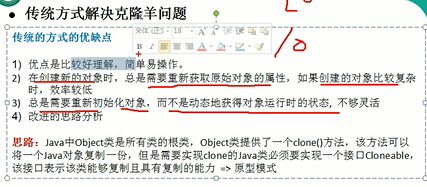
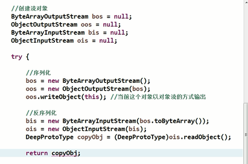

适用场景
---
大批量创建同样的对象

例如发送短信，邮件

原型模式是在内存中对这个对象进行拷贝,要比直接new这个对象性能要好很多,

在这种情况下,需要的对象越多,原型模式体现出的优点越明显

类实现Cloneable接口

重写clone方法

原型模式在克隆对象时，不会执行对应类的构造方法，

而是在内存中（具体地说是堆内存）以二进制流的方式进行拷贝，

重新分配一个内存块。

原型模式的浅拷贝和深拷贝
---

浅拷贝 拷贝对象的指针 共享内存地址 clone的对象修改属性会有影响

深拷贝是申请新的地址 clone的对象互不影响

浅拷贝：
---

浅拷贝使用默认的clone方法来实现 

当拷贝对象包含基本数据类型（如int、long）或者不可变的对象（如字符串、基本类型的包装类）时，会直接将这些属性复制到新的对象中。而原型对象中的引用对象会把内存中的地址复制给克隆对象。此时，两个对象共享了一个私有变量，你改我改大家都能改。

深拷贝：
---

深拷贝两种实现方式

    重写clone方法实现深拷贝

    通过对象Serializable读取二进制流实现深拷贝

    序列化this输出流 再使用输入流反序列构造一个新的对象

不管原型对象属性是简单数据类型还是引用对象类型都会完全的复制一份到新的对象中。两个对象之间互不影响。