引言
---

##### 技术债务


一位名为Dag Liodden技术管理人员将技术债务的三大类型为：故意、意外/过时设计、数据溃烂。国内的一些开发者也有将技术负债分为代码、架构和数据。我认为前后三者内容大抵相似。

##### 1 故意债务（代码）

开发工程师通常会知道做一件事的正确方式和快速方式。在大部分情况下，快速的方式就是正确的方式，但有时开发团队会为了尽快将产品推出上线而故意选择“错误的”方式。


##### 2 意外/过时设计债务（架构）

随着系统发展和要求改变，你可能会意识到自己的设计存在欠缺，或者新功能的运行变得太困难或是太缓慢。一个好的原始设计往往更容易逐步重构，但有时你可能需要硬着头皮进行更大的重构。

##### 3 数据溃烂债务（数据）

数据溃烂型技术债务随着时间推移而产生。一个组件或系统会通过大量的增量而慢慢地演变出不必要的复杂性，在不完全了解原始设计的人员工作时，这一情况会更为显著。


##### 单体、微服务和无服务器的设计架构演变

从具体的代码设计到宏观的项目架构。都脱不开对设计的理解，高级工程师管理一个微服务只要熟读设计模式，可以熟练地使用，就可以把一个微服务改造得非常好。微服务的开发，可能连使用复杂设计模式的机会都没有，在云原生的领域里已经把单体应用的架构模块设计通过微服务及基础设施解耦掉了，数据库也分了缓存数据库，关系型数据库，非关系型数据库。甚至做到了 Service Mesh（服务网格）到现在了Serverless（无服务器架构）。面向云原生开发你只需要专注于把业务代码写出来就可以。

这一次我们主要说一下代码和架构方面的设计模式，在检视中我们的项目，尽早发现设计方面的问题，选用更合适的设计模式。代码已经写完以后才发现设计有问题就晚了，这时技术债务就已经形成了。所以代码检视的过程是学习的过程，也是相互学习成长的过程。

设计模式原则
---

设计模式有20余种（主流是23种），即便种类繁多，这些设计模式基本都遵循的如下6个原则。


SOLID原则-SRP 开放-封闭原则(对扩展开放，对修改关闭):

    软件件实体如类、模块和函数应该对扩展应该是开放的，对修改是封闭的，通俗来说就是，开发一个软件时，应该对其进行功能扩展，而在进行这些扩展时，不需要对原来的程序进行修改。


SOLID原则-OCP 单一职责原则(一个类或者一个方法只负责一项职责):

    对一个类而言，应该仅有一个引起它变化的原因。 如果存在多于一个动机去改变一个类，那么这个类就具有多于一个的职责，就应该把多余的职责分离出去，再去创建一些类来完成每一个职责。不仅仅适用于类，还适用于方法。

SOLID原则-LSP 里式替换原则(继承):

    子类可以扩展父类的功能，但是不能改变父类原有的功能。子类可以实现父类的抽象方法，但不能覆盖父类的非抽象方法。

SOLID原则-DIP 依赖倒置原则(针对接口编程，依赖于抽象而不依赖于具体):

    依赖倒置原则是实现开闭原则的重要途径之一，它降低了客户与实现模块之间的耦合。由于在软件设计中，细节具有多变性，而抽象层则相对稳定，因此以抽象为基础搭建起来的架构要比以细节为基础搭建起来的架构要稳定得多。这里的抽象指的是接口或者抽象类，而细节是指具体的实现类。使用接口或者抽象类的目的是制定好规范和契约，而不去涉及任何具体的操作，把展现细节的任务交给它们的实现类去完成。
    使用接口或抽象类的目的是制定好规范，而不涉及任何具体的操作，把展现细节的任务交给他们的实现类去完成。依赖倒置的中心思想是面向接口编程。


SOLID原则-ISP接口隔离原则(使用多个隔离的接口，比使用单个接口要好):

    接口隔离原则（Interface Segregation Principle，ISP）要求程序员尽量将臃肿庞大的接口拆分成更小的和更具体的接口，让接口中只包含客户感兴趣的方法。2002 年罗伯特·C.马丁给“接口隔离原则”的定义是：客户端不应该被迫依赖于它不使用的方法（Clients should not be forced to depend on methods they do not use）。
    该原则还有另外一个定义：一个类对另一个类的依赖应该建立在最小的接口上（The dependency of one class to another one should depend on the smallest possible interface）。以上两个定义的含义是：要为各个类建立它们需要的专用接口，而不要试图去建立一个很庞大的接口供所有依赖它的类去调用。接口隔离原则和单一职责都是为了提高类的内聚性、降低它们之间的耦合性，体现了封装的思想，
    但两者是不同的：单一职责原则注重的是职责，而接口隔离原则注重的是对接口依赖的隔离。单一职责原则主要是约束类，它针对的是程序中的实现和细节；接口隔离原则主要约束接口，主要针对抽象和程序整体框架的构建。


迪米特法则(一个类或者一个方法只负责一项职责，尽量做到类的只有一个行为原因引起变化):

    迪米特法则的定义是：只与你的直接朋友交谈，不跟“陌生人”说话（Talk only to your immediate friends and not to strangers）。其含义是：如果两个软件实体无须直接通信，那么就不应当发生直接的相互调用，可以通过第三方转发该调用。其目的是降低类之间的耦合度，提高模块的相对独立性。迪米特法则中的“朋友”是指：当前对象本身、当前对象的成员对象、当前对象所创建的对象、当前对象的方法参数等，这些对象同当前对象存在关联、聚合或组合关系，可以直接访问这些对象的方法。


##### 举一个例子：添可电器以旧换新活动

    电器商城最近有一个以旧换新的需求，用户购买注册过添可产品。再购买新商品时可以扣抵一定金额。 但是抵扣优惠是和其他任何优惠互斥的。在此我们把这个优惠认为是一种互斥券。 那么在创建订单时，为了不影响正常的下单流程。我们有两种选择，一是订单接口进行改造，二是重新写一个接口。
    
    我们结合下刚才说的设计模式原则分析下两种的优劣。 直接在订单接口进行改造，因为这个项目是公司买来的 创建订单接口内大量的if else或switch判断，几百上千的代码。我们再讲这个以旧换新的逻辑添加进去。那么就要求写代码时不能误碰误触到老的逻辑代码，而且必须保证优惠券相关的流程是互斥的。对于开发和测试人员都是考验。而且随着日后各种新需求新的优惠券层出不穷，创建订单的接口比如会更加臃肿，难以维护，成为开发人员的'禁区'。这就属于技术负债三大类中的一类：故意负债（快速的方式就是正确的方式）。 
    
    在重新写接口的这个方案中，新的逻辑不会影响到已上线的流程，不需要开发和测试额外花费时间测试已上线流程，做到了业务隔离，但前后端可能重新对接联调新接口，延长了开发时间。这就属于技术负债三大类中的二类：意外/过时设计技术负债(只用了业务隔离，没有别的设计)。 


##### 那么如果要重构或者改造的话，我们需要如何设计创建订单的接口呢？


    首先订单创建作为接口，只定义最简单的创建订单的方法。抽象类（抽象工厂模式）设计订单类型枚举常量，校验参数的方法，实付价格计算（根据订单类型，不同类型订单不同的优惠券扣减算法，策略模式）方法。订单创建完成后续通知方法（如订单未付到时取消，观察者模式）等抽象方法。
    
    然后实体类继承抽象类，根据不同的场景不同的活动来创建多个实体类（装饰器，单一职责）来继承抽象类的方法，如果有必要可以重写抽象类的方法（不同场景不同算法，策略模式）。那么再来一个新的互斥优惠券的话，重新写一个实体类，如果相同的逻辑就用抽象类的方法，如果是不同的逻辑可以再次包装重写抽象类方法。
    
    上述只是创建订单，根据实际情况场景变化做考量。在后续订单流程转化就可以使用状态模式或责任链模式。


##### 这里简单说下状态模式，责任链，策略模式区别：

###### 策略模式
---------------------------

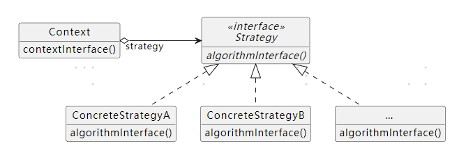

    策略模式实际上是关于使用不同的实现来完成(基本上)相同的事情，因此一个实现可以根据策略的需要替换另一个实现。例如，在策略模式中可能有不同的排序算法。对象的调用者不会根据所采用的策略而改变，但无论采用哪种策略，目标都是相同的(对集合进行排序)。

###### 责任链模式

---------------------------

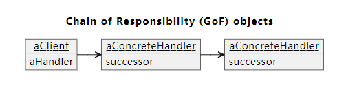
    责任链没有不同的状态。链中的每个节点都尝试处理一个对象，如果一个节点成功处理了该对象，则通常链会停止。
    
    责任链的优点是能够编写新的Handler类以扩展处理功能。但必须修改构建链的代码，以将新处理程序添加为对象。


###### 状态机模式

---------------------------

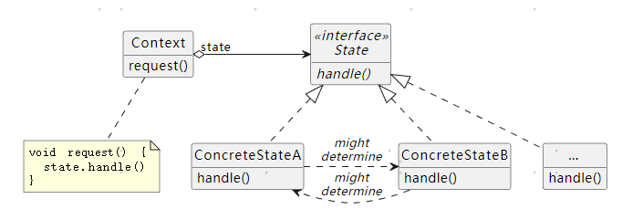

---------------------------

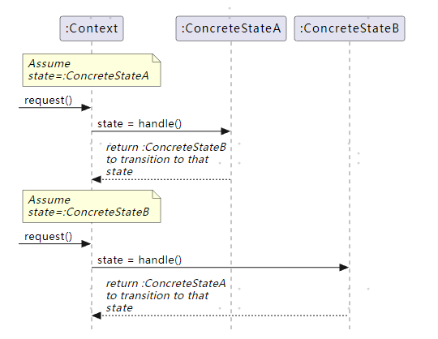


    在状态模式中添加新状态可能不像在责任链模式中添加新处理程序那么容易。
    
    状态模式中的节点是不同的状态。切换到其他节点时，将更改状态。可以连续多次调用同一状态/节点。
    
    状态模式是关于基于状态做不同的事情，同时让调用者从容纳每个可能的状态的负担中解脱出来。因此，例如，我们可能有一个getStatus()方法，该方法将根据对象的状态返回不同的状态，但是该方法的调用者不必为每个潜在的状态编写不同的代码。
    
    状态一旦切换，控制权就得交还给调用者，由调用者，根据新的状态，再指派相应的特定状态，因此，编码一个新的State可能需要修改现有的一些或所有的State类。


责任链模式在Spring中的使用
---

##### Spring源码中的关键字

通过关键字 **Chain** 快速发现源码中使用责任链模式


##### Interceptor过滤器源码

```java
package org.springframework.web.servlet;

...省略部分源码

public class HandlerExecutionChain {

        ...省略部分源码
        
        private final Object handler;
        
        private final List<HandlerInterceptor> interceptorList = new ArrayList<>();
        
        private int interceptorIndex = -1;
        
        //将给定的拦截器添加到此链的末尾。
        public void addInterceptor(HandlerInterceptor interceptor) {       
        
            this.interceptorList.add(interceptor);
            
        }
        
        //将给定的拦截器添加到此链的指定索引处。
        public void addInterceptor(int index, HandlerInterceptor interceptor) {       
        
            this.interceptorList.add(index, interceptor);
            
        }
        
        //应用已注册拦截器的preHandle方法。
        //返回：
        //如果执行链应该继续执行下一个拦截器或处理程序本身，则为true。
        //否则，DispatcherServlet假设这个拦截器已经处理了响应本身。
        boolean applyPreHandle(HttpServletRequest request, HttpServletResponse response) 
            throws Exception {       

            for (int i = 0; i < this.interceptorList.size(); i++) {
            
                   HandlerInterceptor interceptor = this.interceptorList.get(i);
                   
                   if (!interceptor.preHandle(request, response, this.handler)) {
                   
                        triggerAfterCompletion(request, response, null);  
                        
                        return false;          
                   }              
                   this.interceptorIndex = i;       
            }       
             return true;
        }
        
        //应用已注册拦截器的postHandle方法。
        void applyPostHandle(HttpServletRequest request, HttpServletResponse response, 
            @Nullable ModelAndView mv) throws Exception {

            for (int i = this.interceptorList.size() - 1; i >= 0; i--) {              
            
                HandlerInterceptor interceptor = this.interceptorList.get(i); 
            
                 interceptor.postHandle(request, response, this.handler, mv);       
                 
            }
       }
}
```

###### 拦截器在Spring  MVC中的使用：

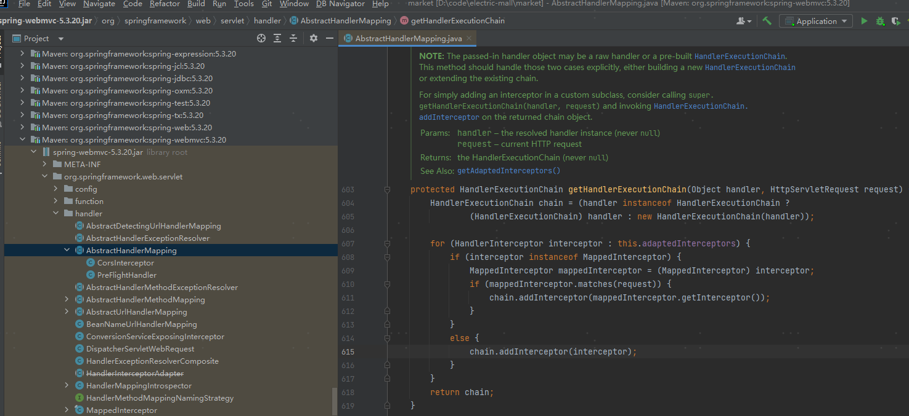

###### Spring MVC的DispatcherServlet前置控制器,拦截请求根据相应的规则分发到目标Controller

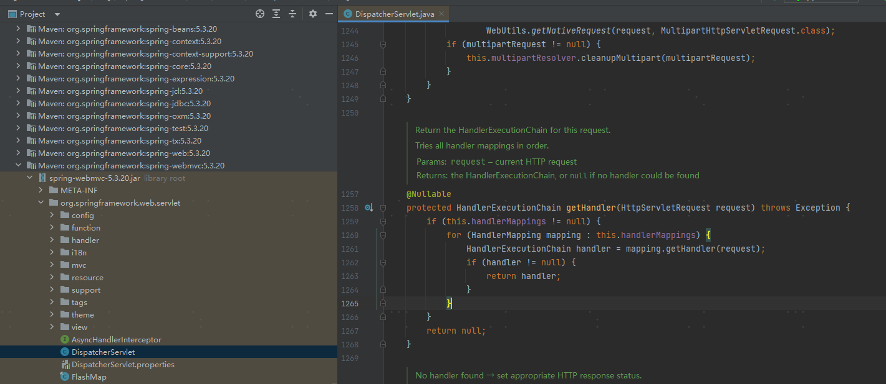

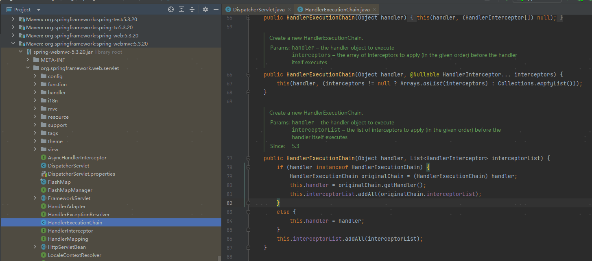

##### Interceptor过滤器调用过程


通过**数组**存储注册在Spring中的**HandlerInterceptor**，然后通过**interceptorIndex**作为指针去遍历责任链数组按顺序调用处理者


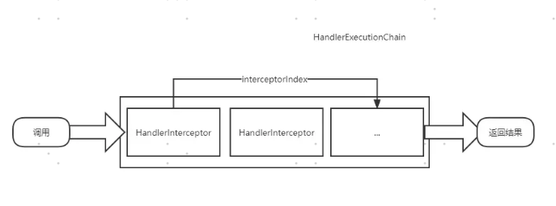

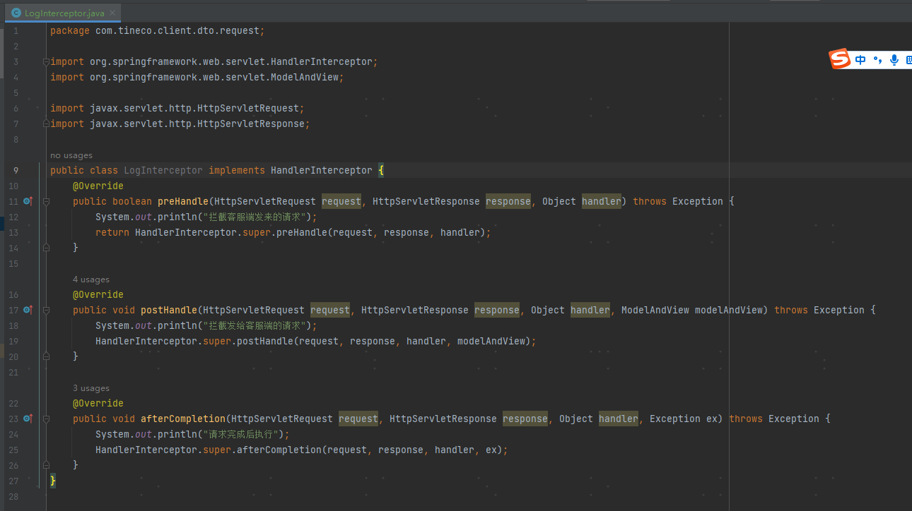

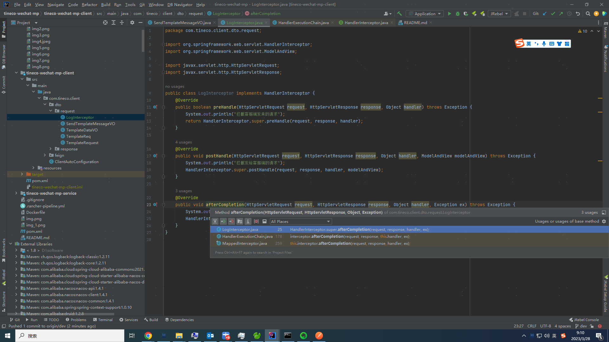

##### Filter过滤器

Filter 过滤器它是 JavaWeb 的三大组件之一。三大组件分别是Servlet 程序、Listener 监听器、Filter 过滤器。
Filter 过滤器它是 JavaEE 的规范，也就是一个接口。
Filter 过滤器它的作用是拦截请求和过滤响应。拦截请求常见的应用场景有权限检查、日记操作、事务管理等等。

Spring Security框架就是通过多个filter类构成一个链条来处理Http请求，从而为应用提供一个认证与授权的框架。

filter chain的实现，用于管理特定请求的一组过滤器的执行。当定义的筛选器集全部执行完毕后，对doFilter()的下一次调用将执行servlet的service()方法本身。

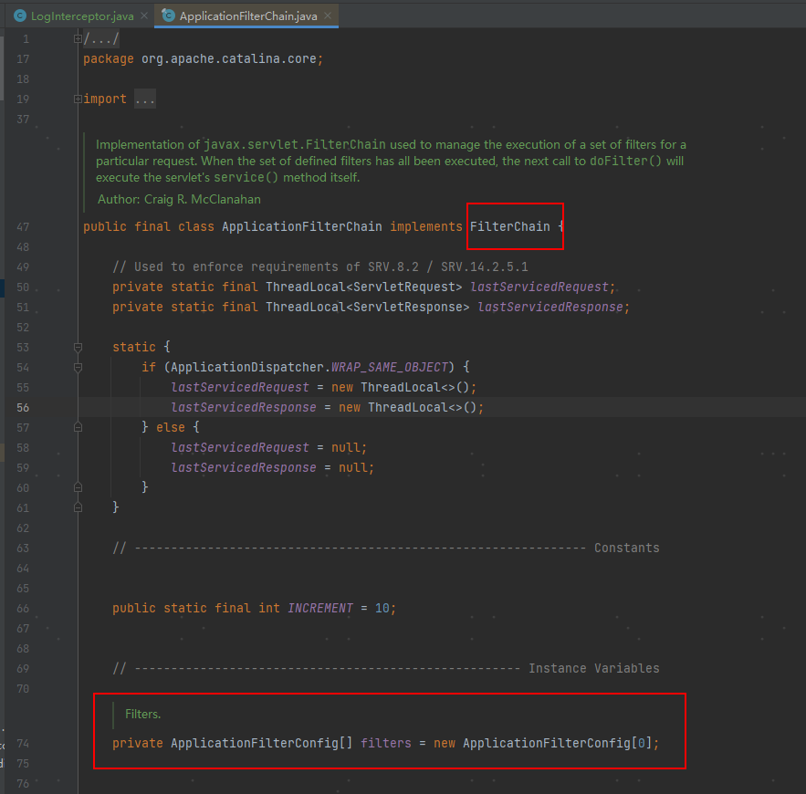

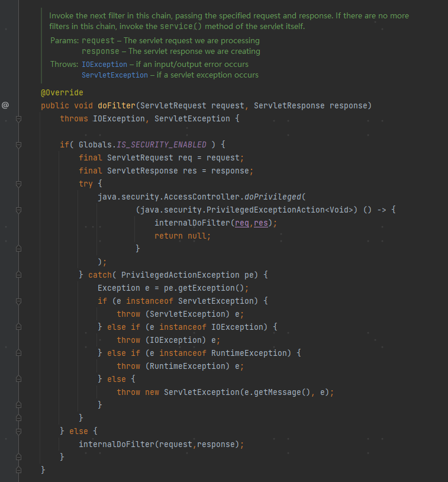

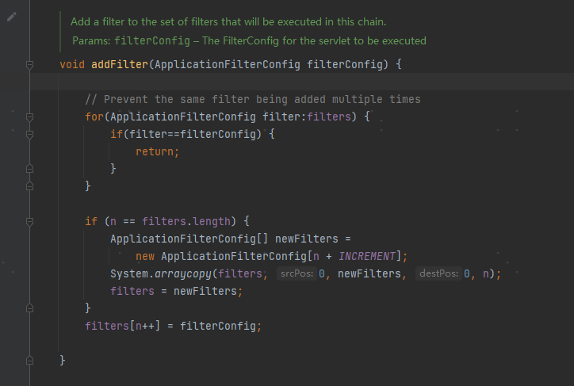

上图也可以看到FilterChain关键词

Servlet中的FilterChain只是一个接口，具体的实现类ApplicationFilterChain类就是Tomcat提供的。


```
除了Servlet Filter, Spring Interceptor, 
Netty中的channel pipeline(双向链表)，Dubbo中的Filter(
ProtocolFilterWrapper类构建Filter链)也是使用了责任链（过滤链）的思路来实现应用的。
```

设计模式类型总结
---

我们在看策略、状态、责任链模式时：咋一瞅，这三类设计模式相差不多，通过文字和UML图来甄别分析三者的不同之处。其实在23种设计模式中，已经有人根据类型目的将设计模式分为了三类。刚才我们说到的策略、和责任链都属于行为型设计模式。而根据模式的主要用于类上还是主要用户对象上来分，这种方式可分为类模式和对象模式两种。

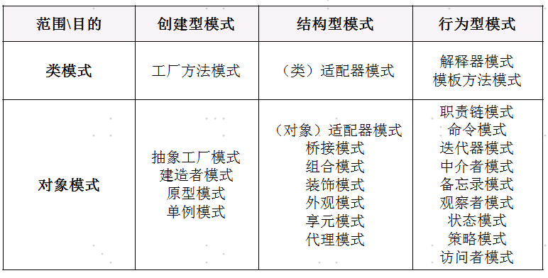


###### 创建型设计模式：

包括单例模式、工厂模式、建造者模式、原型模式。它主要解决对象的创建问题，封装复杂的创建过程，解耦对象的创建代码和使用代码。
关注的是对象的创建，创建型模式将创建对象的过程进行了抽象，也可以理解为将创建对象的过程进行了封装，作为客户程序仅仅需要去使用对象，而不再关心创建对象过程中的逻辑

###### 结构型设计模式:

主要总结了一些类或对象组合在一起的经典结构，这些经典的结构可以解决特定应用场景的问题。结构型模式包括：代理模式、桥接模式、装饰器模式、适配器模式、门面模式、组合模式、享元模式。
解决怎样组装现有的类，设计他们的交互方式，从而达到实现一定的功能。


###### 行为型设计模式:

创建型设计模式主要解决“对象的创建”问题，结构型设计模式主要解决“类或对象的组合”问题，那行为型设计模式主要解决的就是“类或对象之间的交互”问题。行为型模式比较多，有11种，它们分别是：观察者模式、模板模式、策略模式、职责链模式、迭代器模式、状态模式、访问者模式、备忘录模式、命令模式、解释器模式、中介模式。
行为型模式是对在不同的对象之间划分责任和算法的抽象化，行为型模式不仅仅关注类和对象的结构，而且重点关注他们之间的相互作用，通过行为型模式，可以更加清晰地划分类与对象的职责，并研究系统在运行时实例对象之间的交互。