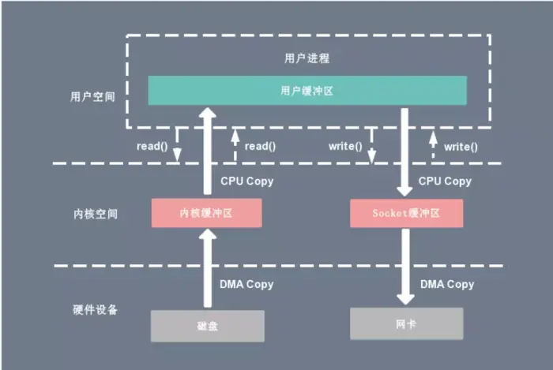
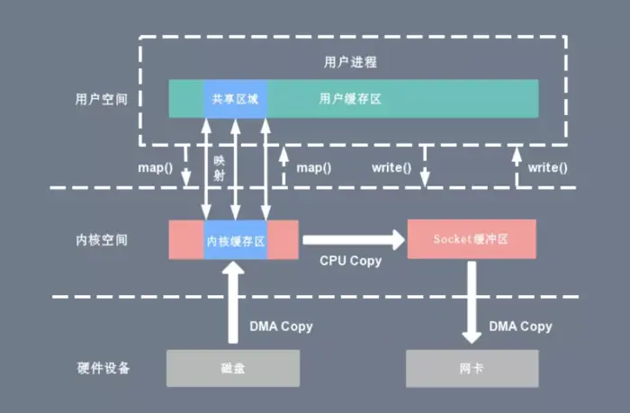
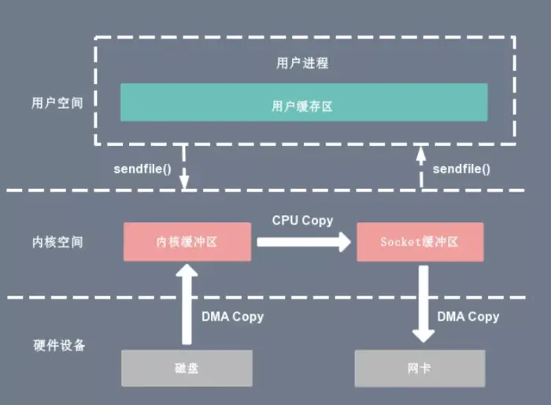
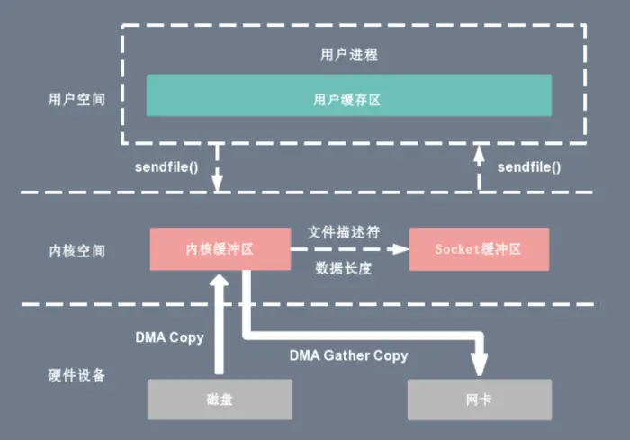

zero-copy

传统IO需要用户空间，内核空间切换，上下文切换（用户和内核切换就需要上下文切换， CPU拷贝）



mmap(内存映射)
---

mmap() 系统调用函数会直接把内核缓冲区里的数据「映射」到用户空间，

这样，操作系统内核与用户空间就不需要再进行任何的数据拷贝操作。

不走用户空间，直接在内核空间进行操作。但由于内存映射机制并不会减少上下文切换次数。



sendFile
---
linux 内核 2.1版本中 系统调用函数sendFiles，直接省去了内核和用户空间的映射。对用户空间是无感知的。

但这个还是要经过socket buffer。



从 Linux 内核 2.4 版本开始起，对于支持网卡支持 SG-DMA 技术的情况下:

第一步，通过 DMA 将磁盘上的数据拷贝到内核缓冲区里；

第二步，缓冲区描述符和数据长度传到 socket 缓冲区，
这样网卡的 SG-DMA 控制器就可以直接将内核缓存中的数据拷贝到网卡的缓冲区里，
此过程不需要将数据从操作系统内核缓冲区拷贝到 socket 缓冲区中，这样就减少了一次数据拷贝。




Java中的实现
---
NIO库中的 FileChannel.transferTo就使用到了sendfile系统函数
```
@Overridepublic 
long transferFrom(FileChannel fileChannel, long position, long count) throws IOException { 
    return fileChannel.transferTo(position, count, socketChannel);
}
```

参考：
---
https://zhuanlan.zhihu.com/p/485632980

https://zhuanlan.zhihu.com/p/258513662

https://www.likecs.com/show-205133451.html

https://www.bilibili.com/video/BV1SB4y1Q7pi?p=101&vd_source=6ea6d1d2145416db083871908dc86913