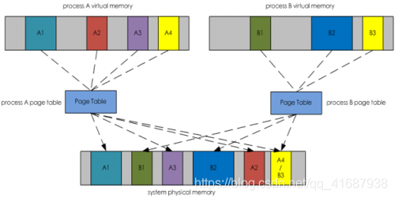
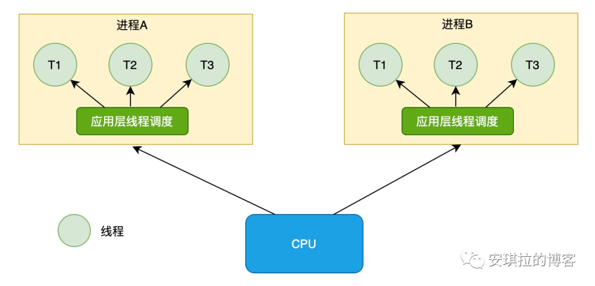
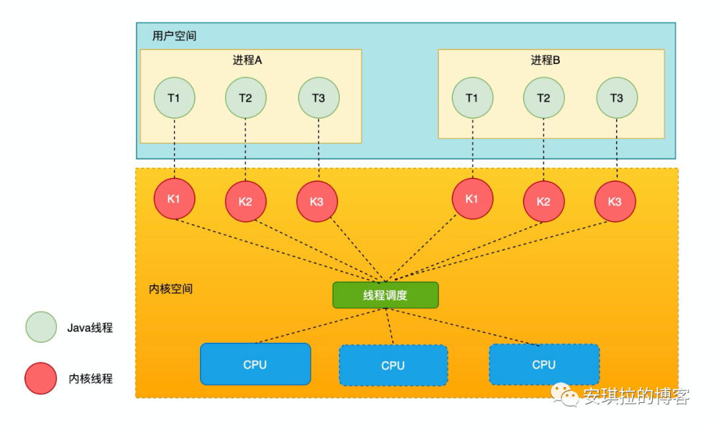

物理内存和虚拟内存
---

物理内存和进程中的虚拟内存通关映射来维护和物理内存的关系, 叫 页映射表（ page table）

虚拟内存地址是连续的，映射到物理内存的地址不一定是连续的。

而上图中的灰色的是驻留内存

被映射到进程虛拟内存空间的物理内存。上图1中，在系统物理内存空间中被着色的部分都是驻留内存。比如，A1、A2、A3和A4是进程A的驻留内存

B1、B2和B3是进程B的驻留内存。

用户空间和内核空间
---
早期系统不区分用户和内核空间，但这样应用程序随意访问任何内存空间，程序就可以把系统搞崩掉，比如清楚内存数据。

后来就按照CPU指令重要程度分级。

linux 只使用了 Ring0 和 Ring3 两个运行级别，进程运行在 Ring3 级别时运行在用户态，指令只访问用户空间，

而运行在 Ring0 级别时被称为运行在内核态，可以访问任意内存空间。

内核态和用户态
---
当进程/线程运行在内核空间时就处于内核态，而进程/线程运行在用户空间时则处于用户态。

比如Java进程内创建一个线程，需要调用c++本地方法 最终执行 pthread_create 在操作系统中创建线程，涉及了内核态的切换。

除了系统调用（软中断）,还有硬中断，硬件触发的。或者发送异常了。

Java线程和操作系统的线程
---

最初 线程由用户空间创建，操作系统不管。

目前的Java线程和操作系统线程是1:1对应的，有映射关系。

什么是上下文
---
CPU 寄存器，是CPU内置的容量小、但速度极快的内存。而程序计数器，则是用来存储 CPU 正在执行的指令位置、或者即将执行的下一条指令位置。它们都是 CPU 在运行任何任务前，必须的依赖环境，因此叫做CPU上下文。

什么是上下文切换？
---
它是指，先把前一个任务的CPU上下文（也就是CPU寄存器和程序计数器）保存起来，然后加载新任务的上下文到这些寄存器和程序计数器，最后再跳转到程序计数器所指的新位置，运行新任务。

一般我们说的上下文切换，就是指内核（操作系统的核心）在CPU上对进程或者线程进行切换。进程从用户态到内核态的转变，需要通过系统调用来完成。系统调用的过程，会发生CPU上下文的切换。
————————————————

协程
---

GO语言就有协程。

可在单个进程里执行成千上万的并发任务。

协程属于线程，协程是在线程里面执行的。

协程只在用户空间执行，不会切换到内核态。避免了用户态和内核态的切换。

参考：
---
https://os.51cto.com/article/641015.html

