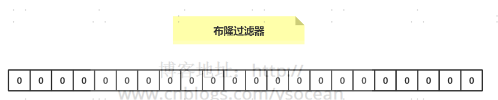

优点是搞笑查询和插入 但是存在hash冲突 准确率不是百分百

问题
---
判断10万个电话号码是否在50亿数据中

添加数据
---

介绍概念的时候，我们说可以将布隆过滤器看成一个容器，那么如何向布隆过滤器中添加一个数据呢？

如下图所示：当要向布隆过滤器中添加一个元素key时，

我们通过多个hash函数， 算出一个值，然后将这个值所在的方格置为1。

比如，下图hash1(key)=1，那么在第2个格子将0变为1（数组是从0开始计数的），hash2(key)=7，

那么将第8个格子置位1，依次类推。

判断数据是否存在？
---

知道了如何向布隆过滤器中添加一个数据，那么新来一个数据，我们如何判断其是否存在于这个布隆过滤器中呢？

很简单，我们只需要将这个新的数据通过上面自定义的几个哈希函数，分别算出各个值，

然后看其对应的地方是否都是1，如果存在一个不是1的情况，那么我们可以说，该新数据一定不存在于这个布隆过滤器中。

反过来说，如果通过哈希函数算出来的值，对应的地方都是1，那么我们能够肯定的得出：

这个数据一定存在于这个布隆过滤器中吗？

答案是否定的，因为多个不同的数据通过hash函数算出来的结果是会有重复的，

所以会存在某个位置是别的数据通过hash函数置为的1。

我们可以得到一个结论：

布隆过滤器可以判断某个数据一定不存在，但是无法判断一定存在。

设置值
---
setbit key offset value

获取值
---

getbit key offset

Redisson 来构造布隆过滤器
---

    public class RedissonBloomFilter {
    
        public static void main(String[] args) {
            Config config = new Config();
            config.useSingleServer().setAddress("redis://192.168.14.104:6379");
            config.useSingleServer().setPassword("123");
            //构造Redisson
            RedissonClient redisson = Redisson.create(config);
     
            RBloomFilter<String> bloomFilter = redisson.getBloomFilter("phoneList");
            //初始化布隆过滤器：预计元素为100000000L,误差率为3%
            bloomFilter.tryInit(100000000L,0.03);
            //将号码10086插入到布隆过滤器中
            bloomFilter.add("10086");
     
            //判断下面号码是否在布隆过滤器中
            System.out.println(bloomFilter.contains("123456"));//false
            System.out.println(bloomFilter.contains("10086"));//true
        }
    }

guava 来构造布隆过滤器
---

    public class GuavaBloomFilter {
    public static void main(String[] args) {
    BloomFilter<String> bloomFilter = BloomFilter.create(Funnels.stringFunnel(Charsets.UTF_8),100000,0.01);
    
            bloomFilter.put("10086");
     
            System.out.println(bloomFilter.mightContain("123456"));
            System.out.println(bloomFilter.mightContain("10086"));
        }
    }

Redis可以通过使用位图（BitMap）来实现布谷鸟过滤器。具体实现步骤如下：
---

创建一个位图，位图的大小可以根据需要来确定，可以使用Redis的BITMAPS命令来创建位图，例如：

    BITMAPS create myfilter 1000000

这个命令会创建一个名为myfilter的位图，大小为1000000位（约125KB）。

创建多个哈希函数，用于将元素映射到位图中的多个位置。可以使用多个不同的哈希函数，例如MurmurHash、FNV Hash、Jenkins Hash等。

将元素加入布谷鸟过滤器中，将元素通过多个哈希函数映射到位图中的多个位置，并将这些位置的值都设为1。可以使用Redis的BITMAPS命令来设置位图中的位，例如：

    BITMAPS setbit myfilter 1001 1

这个命令会将位图中第1001位的值设为1。

判断一个元素是否在布谷鸟过滤器中，将元素通过多个哈希函数映射到位图中的多个位置，如果这些位置的值都为1，则认为这个元素在布谷鸟过滤器中，否则认为不在布谷鸟过滤器中。可以使用Redis的BITMAPS命令来查询位图中的位，例如：

    BITMAPS getbit myfilter 1001

这个命令会查询位图中第1001位的值。

需要注意的是，布谷鸟过滤器的误判率取决于位图的大小和哈希函数的个数，可以通过调整这些参数来控制误判率的大小。另外，布谷鸟过滤器的删除操作比较困难，因为删除一个元素可能会影响到其他元素的判断结果，因此一般不建议删除元素。