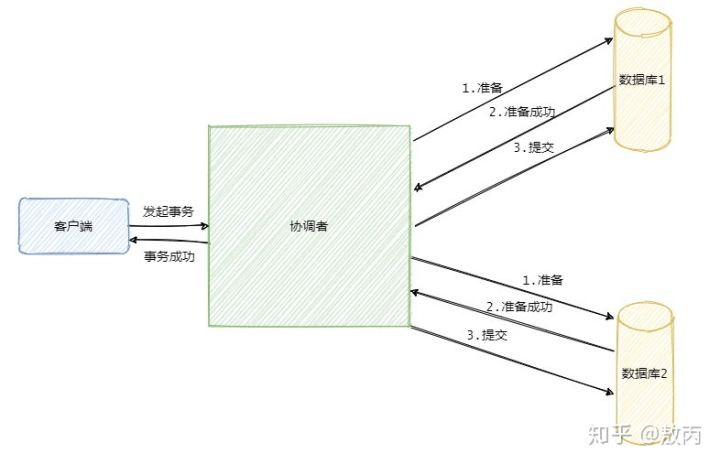
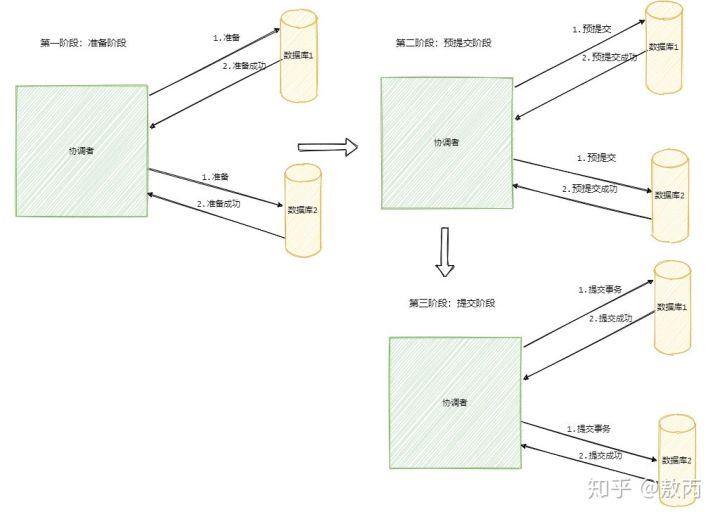
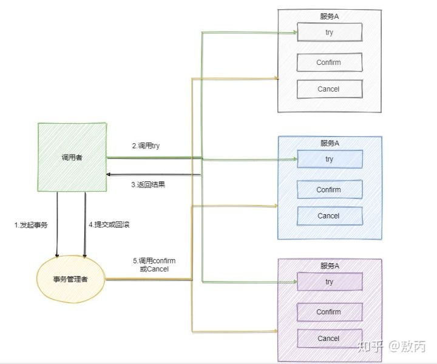

2pc(两阶段提交)
---

准备->提交（回滚）

发起事务 由事务协调者发起，调用业务A，业务B，

准备的时候，是同步等待A，B服务都响应成功，

然后才让A，B都提交数据。

第一阶段是准备，第二阶段是提交，如果是失败了那就回滚。

无论是第一阶段还是第二阶段都要A,B都要成功，有一个失败，整个回滚。

对业务入侵相对较低，但是事务协调者单机不稳定，

要考虑单主多从，多住主多从，leader挂掉 slave选举， 还有数据同步问题。

它是一个强一致性的同步阻塞协议，

事务执⾏过程中需要将所需资源全部锁定，也就是俗称的 刚性事务。所以它比较适⽤于执⾏时间确定的短事务，整体性能比较差。

3pc(三阶段提交)
---

相对于2PC的准备->提交（回滚）

多了一个预提交，就是：准备阶段->预提交->提交（回滚）

就是查看所有服务是否有能力提供功能，有没有挂掉，不会说，一开始就把相关资源锁定。

TCC
---

相较于2PC，和3PC，TCC的思路差不多，但是对业务项目入侵严重。

Try - Confirm - Cancel 预留，确认，撤销。

三个操作都要写到业务代码里面。开发量更大。

参考：
---

https://zhuanlan.zhihu.com/p/183753774

https://www.cnblogs.com/chengxy-nds/p/14046856.html

本地消息表
---

实现方案-阿里开源的seata
---