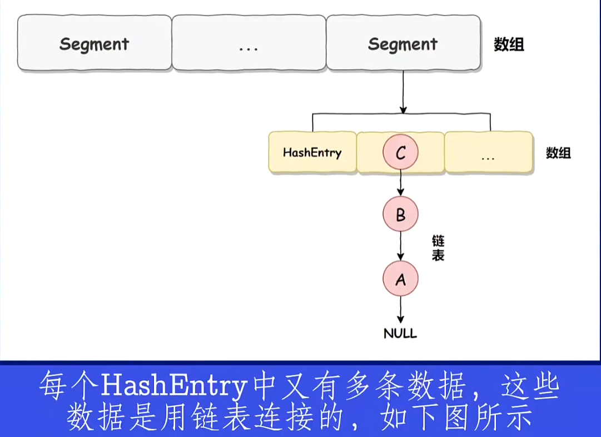
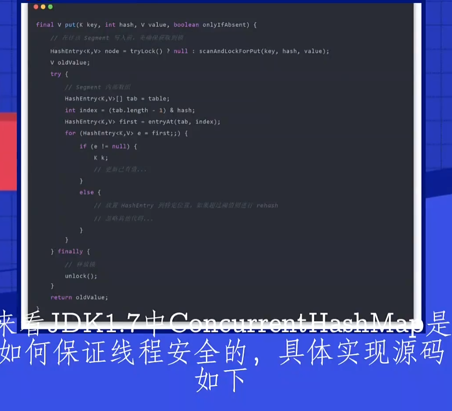

concurrentHashMap 1.7
---
在hashtable中用synchronized锁住整个操作，读写 读读都会阻塞

数组加链表实现。

concurrentHashMap 在使用了分段锁 segment（部分， 片段）

一共16个segment segment继承了reentrantLock 理论上支持支持16个线程的并发

concurrentHashMap 大数组 segment 和 小数组 hashEntry

每个hashEntry中又有很多条数据，这些数据就LinkedList组成的。

能保证线程安全的原因是Segment继承了重入锁ReentrantLock

每个锁控制的是一段，当每个Segment越来越大时，锁的粒度就变得有些大了。并发性能就越来越差。

而且链表的查询性能随着长度增加越来越差（找数据得按照next一个一个找）。

concurrentHashMap 1.8
---

数组加链表或红黑树。

用CAS + volatile + synchronized保证线程安全。

HashEntry 改为 Node

与JDK7 的 HasEntry 作用相同，对 val 和 next 都用了 volatile 关键字，保证了可见性

PUT操作：
---

1、根据 key 计算出 hashcode，然后开始遍历 table;

2、判断是否需要初始化；

3、f 即为当前 key 定位出的 Node，如果为空表示当前位置可以写入数据，利用 CAS 尝试写入，失败则自旋保证成功。

4、如果当前位置的 hashcode == MOVED == -1,则需要进行扩容。

5、如果都不满足，则利用 synchronized 锁写入数据。

6、如果数量大于 TREEIFY_THRESHOLD 则要转换为红黑树。

添加元素时看容器如果是空的情况下 初始化的操作是用CAS+volatile

如果容器不为空，根据存储的元素计算该位置是否为空。

如果为空就用CAS设置节点。如果不为空就用synchronized加锁遍历桶中的数据。

替换或者新增节点到桶中，最后判断是否需要转为红黑树。

在jdk 1.8中。concurrentHashMap使用在头节点加锁保证线程安全的。

synchronized 只锁定当前链表或红⿊⼆叉树的⾸节点，这样只要 hash 不冲突，就不会产⽣并发，效率⼜提升 N 倍。

锁的粒度比1.7的segment的维度要细化很多。

红黑树的性能O（logn）也比链表O(n)好。

GET操作：
---
通过node中的volatile 和 Uasafe的方法保证线程安全。不像hashtable还加synchronized。

为什么concurrentHashMap和hashTable这种线程安全的集合不允许插入null（KEY和VALUE都不行）值？
---
插入判断如果是null抛出空指针异常。

hashMap允许null值，因为hashMap是给单线程用的，多线程concurrentHashMap并发，值为null还是到底不存在？

Doug Lea 认为多线程并发情况下不允许歧义。

计算hash值和put寻址
---

https://www.bbsmax.com/A/x9J2NyeVJ6/

右移16位相当于将高16位移入到低16位，再与原hashcode做异或计算（位相同为0，不同为1）

(table.length - 1) & hash的方式得到key在table中的下标

异或运算（^）更加均匀，如果采用 & （与运算）计算出来的值会向0靠拢，采用 | （或运算）计算出来的值会向1靠拢

参考：
https://blog.csdn.net/qq_41767116/article/details/113734561

https://blog.csdn.net/qq_29051413/article/details/107869427