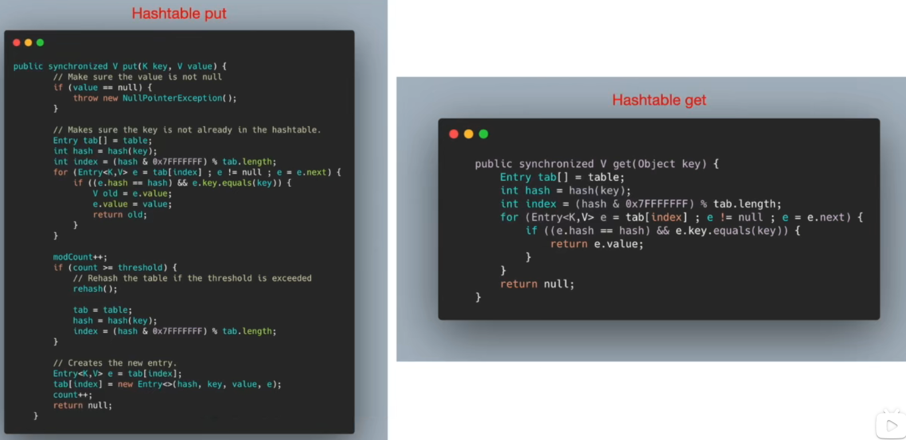
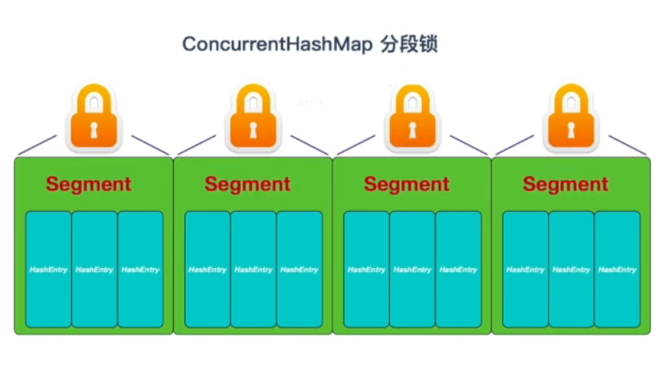
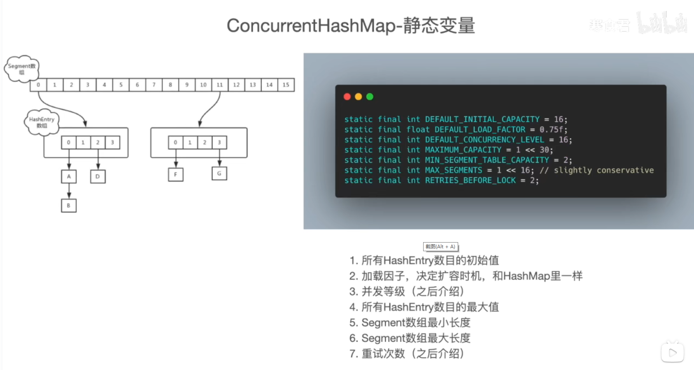
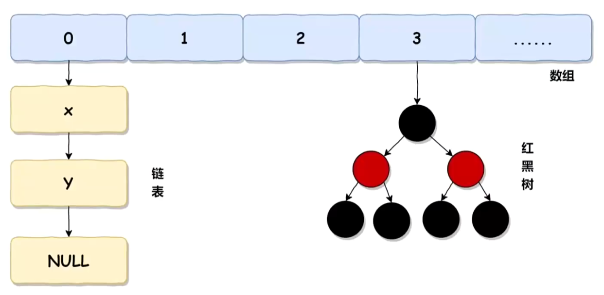
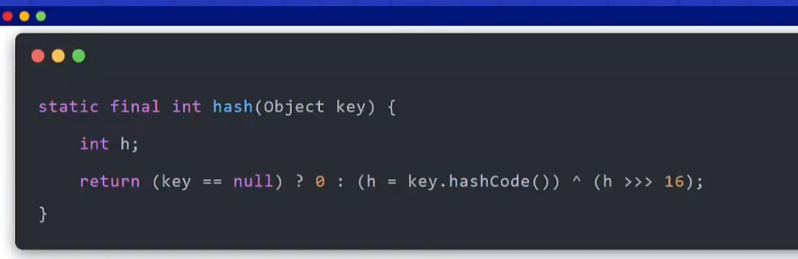
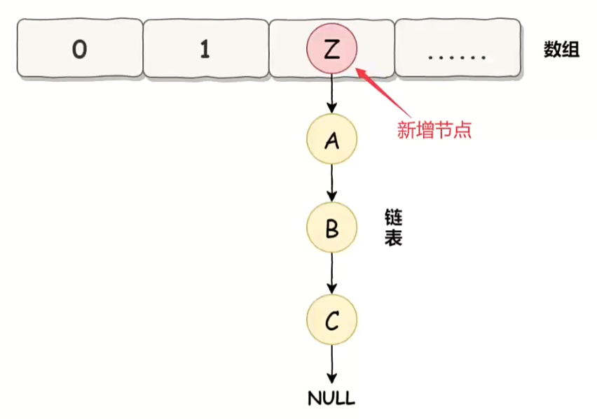
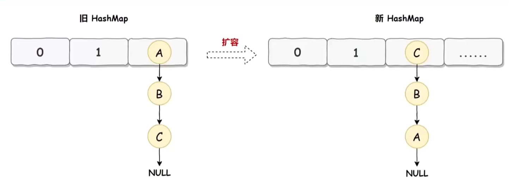

hash算法及问题
---

根据业务key hash后取模(比方说3个节点就是 key % 3) 

如果新增了一个节点，那么现在就是key % 4 会导致 映射关系发生变化，查不到数据。

节点的扩容和收缩会导致hash算法在节点变化时，要更多考虑数据迁移的问题。

一致性hash算法
---

固定长度为2^32的hash环，对0到2^32进行取模，把这些数据想象成一个环。

一致性hash要分两步hash：

一是对服务器地址比如ID进行hash,比如说三个服务器节点映射到整个环上分布了到四个位置;

二是对对查询数据的key进行hash;

比如说查询数据叫 name=key1 进行hash运算后，

按顺时针方向，找到的第一个节点，那么查询就会落到该节点上。

key2的请求就会打到B节点，key3就会达到C节点。

在服务器不变的情况下，请求永远会打到相同的节点上。

一致性hash数据倾斜
---
但在实际情况下，服务器节点hash后，分散到环上面并不一定是均匀的。

如上图所示，从节点C后面开始到节点A的所有请求都会打到节点A上面。

通过增加虚拟节点提高均衡度
---

基于节点A,B,C增加虚拟节点A-01、A-02、A-03、B-01、B-02、B-03、C-01、C-02、C-03。

此时hash是环上面就是9个节点。

如果说请求打到了A-02这个虚拟节点，通过映射关系，就会打到真实的节点A上面。

如果节点A下线宕机了，那么-01、A-02、A-03这三个虚拟节点也会撤销。

在真实环境中，一个真实节点可能有数十个，上百个虚拟节点，节点越多，整个环分布的越均匀。

Java实现
---

Java上实现hash环使用treeMap（有序的）,也就是红黑树。来作为hash环的存储结构。

参考
---
https://mp.weixin.qq.com/s/tu7LMBowWQX1aiEeKlmAJA

https://www.cnblogs.com/aganippe/p/16009141.html